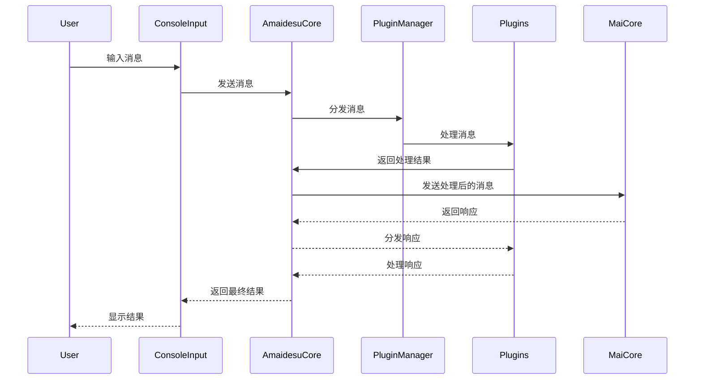
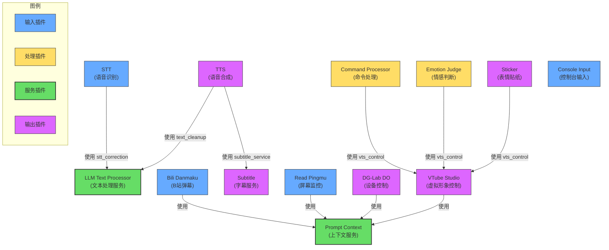

<br />
<div align="center">

# Amaidesu

Amadeus?

Amaidesu!

### -project alphia - 在zzzzyc/d的强烈要求下添加

  
  
  
  
  
  


## 📝 项目简介


聊天机器人麦麦的[VTubeStudio](https://github.com/DenchiSoft/VTubeStudio) 适配器。
其聊天核心为[麦麦Bot](https://github.com/aiM-with-u/MaiBot)，一款专注于 群组聊天 
的赛博网友 QQ BOT。

</div>

## 架构概述

主要由以下几个核心组件构成：

1. **AmaidesuCore**: 核心模块，负责与 MaiCore 的通信，有服务注册与发现、消息分发的功能。
2. **PluginManager**: 插件管理器，负责插件的加载和管理
3. **BasePlugin**: 插件基类，定义插件的基本接口
4. **插件系统**: 各种功能插件，如 TTS、STT、LLM 等。各个插件可以利用被注入的 AmaidesuCore 实例发送消息给 MaiCore，在 AmaidesuCore接收到消息时，会分发给注册了对应处理类型的插件进行处理。也可以将本插件作为服务注册到 AmaidesuCore 中，供其他插件使用。

### 消息处理时序图



## 已有插件

### 插件列表

| 插件名 | 功能描述 | 类型 |
|-------|---------|------|
| bili_danmaku | 连接B站直播间并接收弹幕消息，将弹幕转换为系统消息 | 输入 |
| command_processor | 处理消息中的嵌入命令（如%{command:args}%），执行命令后移除标记 | 处理 |
| console_input | 通过控制台输入模拟用户消息，支持配置用户信息和模板 | 输入 |
| dg-lab-do | 控制DG-Lab设备，当检测到特定关键词时触发设备控制 | 输出 |
| emotion_judge | 分析麦麦回复的情感，并触发对应的Live2D表情热键 | 处理 |
| llm_text_processor | 基于大语言模型的文本处理工具，用于文本清理和STT结果修正 | 服务 |
| prompt_context | 管理和聚合上下文信息，允许其他插件注册和获取上下文 | 服务 |
| read_pingmu | 监控屏幕内容并通过视觉语言模型生成描述，作为上下文提供 | 输入 |
| sticker | 处理表情贴纸，将表情图片发送到VTube Studio中显示 | 输出 |
| stt | 语音转文字功能，通过麦克风采集音频并使用讯飞API识别为文本 | 输入 |
| subtitle | 创建透明置顶窗口，显示AI语音的实时字幕 | 输出 |
| tts | 文本转语音功能，使用Edge TTS引擎将文本转换为语音 | 输出 |
| vtube_studio | 连接VTube Studio API，控制虚拟形象的表情、动作和热键 | 输出 |

### 插件依赖关系

以下图表展示了主要插件之间的服务依赖关系：



## 插件开发

插件开发需要继承 `BasePlugin` 类并实现必要的方法：

```python
from src.core.plugin_manager import BasePlugin
from maim_message.message_base import MessageBase

class MyPlugin(BasePlugin):
    def __init__(self, core: AmaidesuCore, plugin_config: Dict[str, Any]):
        super().__init__(core, plugin_config)
        # 自己的初始化逻辑

    async def setup(self):
        # 注册消息处理器
        await self.core.register_websocket_handler("text", self.handle_message)
        # 也可以将自己这个插件注册为服务供其他插件使用
        self.core.register_service("vts_control", self)
    
    async def handle_message(self, message: MessageBase):
        # 处理MaiCore传递回来的消息
        pass
    
    async def cleanup(self):
        # 清理资源
        pass
```

## 安装与运行

1. 克隆仓库
2. 安装依赖：`pip install -r requirements.txt`
3. 复制需要启动的插件的 `config-template.toml` 为 `config.toml` 并配置
4. 运行：`python main.py`

## 调试模式

使用 `--debug` 参数启用调试日志：

```bash
python main.py --debug
```

## 模拟MaiCore

当你不方便部署麦麦时，可以用它启用一个ws服务端和一个控制台输入任务，便于模拟麦麦的回应来测试插件功能

使用方法：

```bash
python mock_maicore.py
```

现在支持的简单命令：
- sendRandomEmoji: 发送一个随机的表情包，用于测试VTubeStudio的表情包功能


### 如果你需要更多帮助-查阅[help.md](https://github.com/ChangingSelf/Amaidesu/blob/main/help.md)
