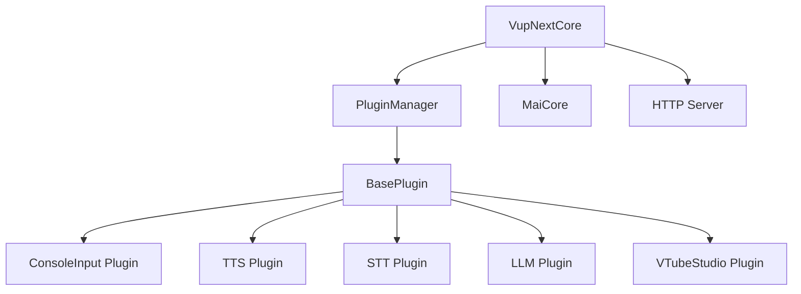
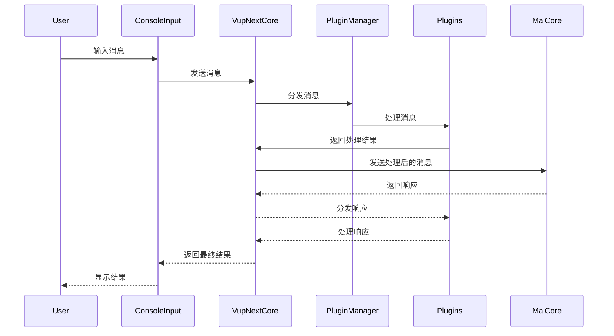

# Amaidesu

聊天机器人麦麦的[VTubeStudio](https://
github.com/DenchiSoft/VTubeStudio)适配器。
其聊天核心为[麦麦Bot](https://github.com/
MaiM-with-u/MaiBot)，一款专注于 群组聊天 
的赛博网友 QQ BOT。

## 架构概述

MaiBot-Vtuber 采用模块化设计，主要由以下几个核心组件构成：

1. **VupNextCore**: 核心模块，负责与 MaiCore 的通信
2. **PluginManager**: 插件管理器，负责插件的加载和管理
3. **BasePlugin**: 插件基类，定义插件的基本接口
4. **插件系统**: 各种功能插件，如 TTS、STT、LLM 等

### 系统架构图



### 消息处理时序图



## 插件开发

插件开发需要继承 `BasePlugin` 类并实现必要的方法：

```python
from src.core.plugin_manager import BasePlugin

class MyPlugin(BasePlugin):
    async def setup(self):
        # 注册消息处理器
        await self.core.register_websocket_handler("text", self.handle_message)
    
    async def handle_message(self, message):
        # 处理消息
        pass
    
    async def cleanup(self):
        # 清理资源
        pass
```

## 安装与运行

1. 克隆仓库
2. 安装依赖：`pip install -r requirements.txt`
3. 复制 `config-template.toml` 为 `config.toml` 并配置
4. 运行：`python main.py`

## 调试模式

使用 `--debug` 参数启用调试日志：

```bash
python main.py --debug
```

