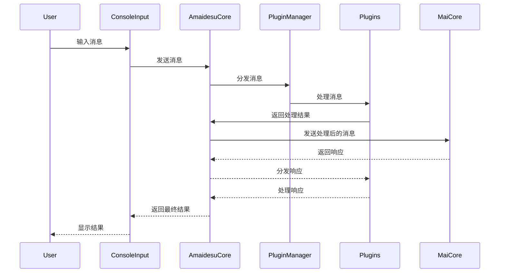
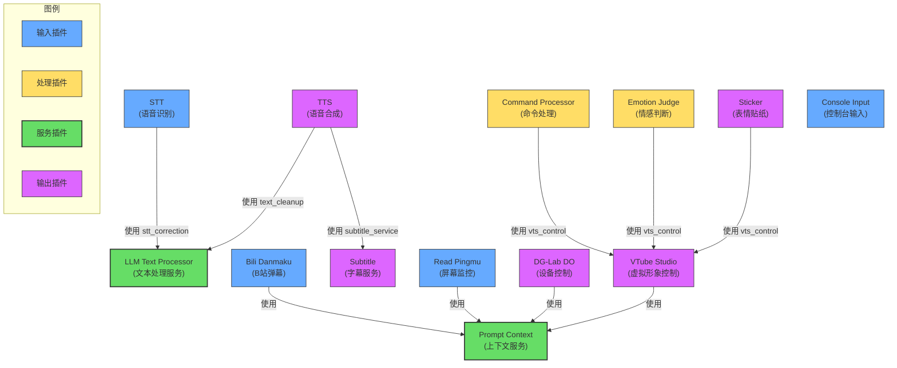

<br />
<div align="center">

# Amaidesu

Amadeus?

Amaidesu!

### -project alphia - 在zzzzyc/d的强烈要求下添加

  
  
  
  
  
  


## 📝 项目简介


聊天机器人麦麦的[VTubeStudio](https://github.com/DenchiSoft/VTubeStudio) 适配器。
其聊天核心为[麦麦Bot](https://github.com/MaiM-with-u/MaiBot)，一款专注于 群组聊天 的赛博网友 QQ BOT。

</div>

## 架构概述

主要由以下几个核心组件构成：

1. **AmaidesuCore**: 核心模块，负责与 MaiCore 的通信，有服务注册与发现、消息分发的功能。
2. **PluginManager**: 插件管理器，负责插件的加载和管理
3. **BasePlugin**: 插件基类，定义插件的基本接口
4. **PipelineManager**: 管道管理器，负责管道的加载和执行，用于在消息发送到 MaiCore 前进行预处理
5. **插件系统**: 各种功能插件，如 TTS、STT、LLM 等。各个插件可以利用被注入的 AmaidesuCore 实例发送消息给 MaiCore，在 AmaidesuCore接收到消息时，会分发给注册了对应处理类型的插件进行处理。也可以将本插件作为服务注册到 AmaidesuCore 中，供其他插件使用。

### 消息处理时序图



## 安装与运行

1. 克隆仓库
2. 安装依赖：`pip install -r requirements.txt`
3. 复制需要启动的插件的 `config-template.toml` 为 `config.toml` 并配置
4. 启动在这之前已经部署好的 MaiMaiCore（参见[MaiBot部署教程](https://docs.mai-mai.org/manual/usage/mmc_q_a)）
5. 运行：`python main.py`

## 运行与配置

1.  **首次运行与配置生成**: 
    - 在首次运行 `python main.py` 之前，请确保根目录下存在 `config-template.toml`。
    - 首次运行会自动检查并根据 `config-template.toml` 创建 `config.toml`。
    - 同时，它也会检查 `src/plugins/` 和 `src/pipelines/` 下各个子目录，如果存在 `config-template.toml` 但不存在 `config.toml`，也会自动复制生成。
    - **重要**: 自动生成配置文件后，程序会提示并退出。请务必检查新生成的 `config.toml` 文件（包括根目录和插件/管道目录下的），填入必要的配置信息（如 API 密钥、设备名称、房间号等），然后再重新运行程序。

2.  **启动程序**: 
    - 配置完成后，使用 `python main.py` 启动应用程序。

3.  **命令行参数**:
    - `--debug`: 启用详细的 DEBUG 级别日志输出，方便排查问题。
      ```bash
      python main.py --debug
      ```
    - `--filter <MODULE_NAME> [<MODULE_NAME> ...]`: 过滤日志输出，只显示指定模块的 INFO/DEBUG 级别日志。WARNING 及以上级别的日志总是会显示。可以指定一个或多个模块名。
      ```bash
      # 只显示来自 StickerPlugin 和 TTS 模块的 INFO/DEBUG 日志 (以及所有模块的 WARN+ 日志)
      python main.py --filter StickerPlugin TTSPlugin 
      
      # 同时启用 DEBUG 并过滤
      python main.py --debug --filter StickerPlugin
      ```
      *   模块名通常是 `src/utils/logger.py` 中 `get_logger("模块名")` 使用的名称，或者插件/管道的类名或目录名（取决于日志记录时如何绑定模块名）。可以通过查看日志输出中的模块名来确定。

## 模拟MaiCore

当你不方便部署麦麦时，可以用它启用一个ws服务端和一个控制台输入任务，便于模拟麦麦的回应来测试插件功能

使用方法：

```bash
python mock_maicore.py
```

现在支持的简单命令：
- sendRandomEmoji: 发送一个随机的表情包（默认在"data/emoji"目录下查找表情包），用于测试VTubeStudio的表情包功能

## 已有插件

### 插件列表

| 插件名 | 功能描述 | 类型 |
|-------|---------|------|
| bili_danmaku | 连接B站直播间并接收弹幕消息，将弹幕转换为系统消息 | 输入 |
| command_processor | 处理消息中的嵌入命令（如%{command:args}%），执行命令后移除标记 | 处理 |
| console_input | 通过控制台输入模拟用户消息，支持配置用户信息和模板 | 输入 |
| dg-lab-do | 控制DG-Lab设备，当检测到特定关键词时触发设备控制 | 输出 |
| emotion_judge | 分析麦麦回复的情感，并触发对应的Live2D表情热键 | 处理 |
| llm_text_processor | 基于大语言模型的文本处理工具，用于文本清理和STT结果修正 | 服务 |
| prompt_context | 管理和聚合上下文信息，允许其他插件注册和获取上下文 | 服务 |
| read_pingmu | 监控屏幕内容并通过视觉语言模型生成描述，作为上下文提供 | 输入 |
| sticker | 处理表情贴纸，将表情图片发送到VTube Studio中显示 | 输出 |
| stt | 语音转文字功能，通过麦克风采集音频并使用讯飞API识别为文本 | 输入 |
| subtitle | 创建透明置顶窗口，显示AI语音的实时字幕 | 输出 |
| tts | 文本转语音功能，使用Edge TTS引擎将文本转换为语音 | 输出 |
| vtube_studio | 连接VTube Studio API，控制虚拟形象的表情、动作和热键 | 输出 |

### 插件依赖关系

以下图表展示了主要插件之间的服务依赖关系：



## 插件开发

插件开发需要继承 `BasePlugin` 类并实现必要的方法：

```python
from src.core.plugin_manager import BasePlugin
from maim_message.message_base import MessageBase

class MyPlugin(BasePlugin):
    def __init__(self, core: AmaidesuCore, plugin_config: Dict[str, Any]):
        super().__init__(core, plugin_config)
        # 自己的初始化逻辑

    async def setup(self):
        # 注册消息处理器
        await self.core.register_websocket_handler("text", self.handle_message)
        # 也可以将自己这个插件注册为服务供其他插件使用
        self.core.register_service("vts_control", self)
    
    async def handle_message(self, message: MessageBase):
        # 处理MaiCore传递回来的消息
        pass
    
    async def cleanup(self):
        # 清理资源
        pass
```

## 管道系统

管道系统用于在消息发送到 MaiCore 前进行预处理。管道可以用于实现各种功能，如消息过滤、限流、内容转换等。

### 管道配置方式

管道的启用和优先级在根目录的 `config.toml` 文件中进行配置。

#### 基本配置

```toml
# 管道配置
[pipelines]
# 已启用的管道及其优先级（数字越小优先级越高）
# 未配置的管道默认不启用
throttle = 100
# 其他管道示例
# custom_pipeline = 200
```

1. `[pipelines]` 部分（主配置文件）：
   - 各配置项为需要启用的管道名称及其优先级值
   - 命名规则：使用蛇形命名法（snake_case），系统会自动转换为驼峰命名法（CamelCase）并添加"Pipeline"后缀
   - 例如：配置中的 `throttle` 会对应代码中的 `ThrottlePipeline` 类

2. 优先级说明：
   - 数字越小，优先级越高（先处理）
   - 配置中未明确列出的管道默认不会被加载

#### 管道特定配置

除了在主配置文件中设置管道优先级外，每个管道也可以有自己的配置文件：

1. 每个管道目录可包含 `config-template.toml` 和 `config.toml` 文件
2. 首次运行时，如果管道目录存在 `config-template.toml` 但没有 `config.toml`，系统会自动复制模板创建配置文件
3. 管道配置文件必须包含与管道同名的段落，例如 `[throttle]`
4. 配置文件中的参数将在管道初始化时自动注入到管道类的 `__init__` 方法中

例如，对于 ThrottlePipeline，配置文件结构如下：

```toml
# src/pipelines/throttle/config.toml

[throttle]
# 是否启用此管道 (注意：此项在主配置中也需要设置优先级)
enabled = true

# 全局消息频率限制（每分钟最大消息数量）
global_rate_limit = 100

# 每个用户消息频率限制（每分钟最大消息数量）
user_rate_limit = 10

# 时间窗口大小（秒）
window_size = 60
```

### 自定义管道开发

要创建自定义管道，需遵循以下步骤：

1. 在 `src/pipelines` 目录下创建新的包目录，如 `my_pipeline`
2. 在包目录中创建 `__init__.py` 文件和 `pipeline.py` 文件
3. 在 `pipeline.py` 中继承 `MessagePipeline` 基类并实现 `process_message` 方法：

```python
# src/pipelines/my_pipeline/pipeline.py
from src.core.pipeline_manager import MessagePipeline
from maim_message import MessageBase
from typing import Optional

class MyPipeline(MessagePipeline):
    # 设置默认优先级
    priority = 500
    
    def __init__(self, param1="default value", param2=42):
        # 初始化管道，可接受参数（将从配置文件中加载）
        self.param1 = param1
        self.param2 = param2
    
    async def process_message(self, message: MessageBase) -> Optional[MessageBase]:
        # 处理消息的逻辑
        # 返回处理后的消息，或返回 None 表示丢弃该消息
        return message
```

4. 在 `__init__.py` 中导出管道类：

```python
# src/pipelines/my_pipeline/__init__.py
from src.pipelines.my_pipeline.pipeline import MyPipeline

__all__ = ["MyPipeline"]
```

5. 创建管道配置模板文件 `config-template.toml`：

```toml
# src/pipelines/my_pipeline/config-template.toml

[my_pipeline]
# 自定义配置参数，这些参数将传递给 MyPipeline 的 __init__ 方法
param1 = "自定义值"
param2 = 100
```

6. 在主配置文件 `config.toml` 中添加启用配置：

```toml
[pipelines]
my_pipeline = 500  # 注意：类名为MyPipeline，配置使用蛇形命名my_pipeline
```

### 管道执行流程

1. 系统初始化时，`PipelineManager` 加载所有已启用的管道
2. 管道按优先级排序（数字越小优先级越高）
3. 消息按优先级顺序依次通过各个管道处理
4. 如果任何管道返回 `None`，消息处理终止（消息被丢弃）
5. 最终处理后的消息发送到 MaiCore 


### 如果你需要更多帮助-查阅[help.md](https://github.com/ChangingSelf/Amaidesu/blob/main/help.md)
