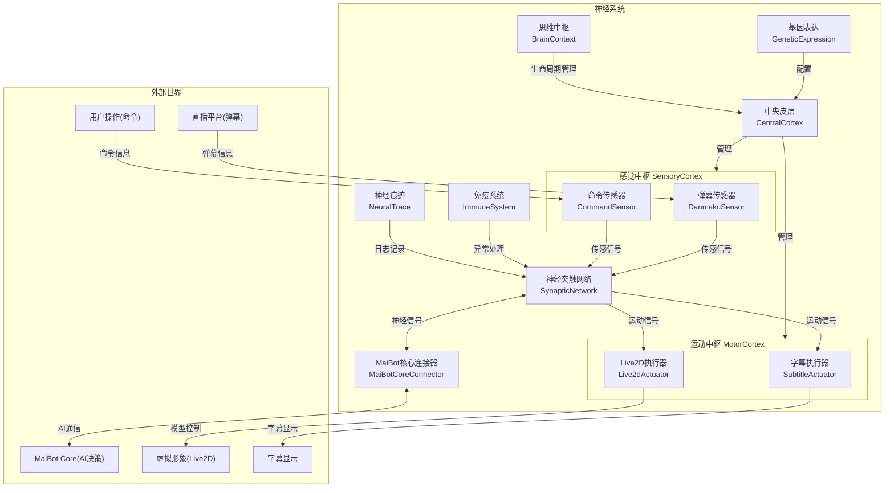
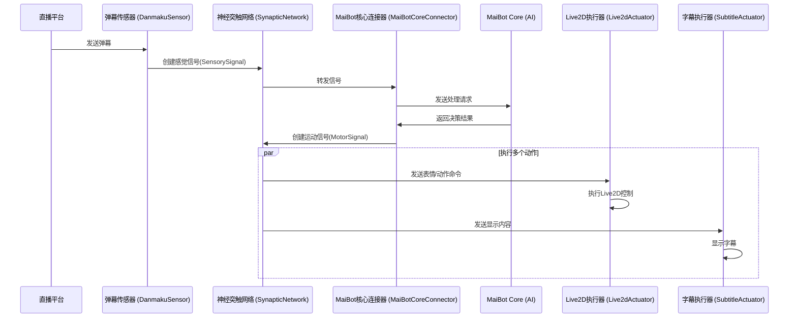

# MaiBot-Vtuber

MaiBot-Vtuber是一个基于[MaiBot核心](https://github.com/MaiM-with-u/MaiBot)的[[VtubeStudio](VTubeStudio](https://github.com/DenchiSoft/VTubeStudio)适配器。

目前只搭建了框架，还在开发中。

main分支为~~Cursor辅助~~人类辅助重构后的代码，旧代码在legacy-demo分支

## 安装

```bash
# 克隆仓库
git clone https://github.com/yourusername/MaiBot-Vtuber.git
cd MaiBot-Vtuber

# 安装依赖
pip install -r requirements.txt

# 安装开发依赖(可选)
pip install -r requirements-dev.txt
```

## 快速开始

1. 配置系统:

```bash
# 复制默认配置文件
cp config/default.yaml config/config.yaml

# 编辑配置文件
nano config/config.yaml
```

2. 启动系统:

```bash
python src/main.py
```

## 架构概览

1. 项目作为适配器，转换各种直播平台弹幕，通过Websocket传递给MaiBot Core；
2. MaiBot Core作出决策或回应后，将决策或回应消息返回回来；
3. 输出到CustomTkinter字幕（回应消息），或者调整Vtuber live2d的表情（动作决策）

### 神经系统相关命名和实际功能

由于麦麦核心中使用了大脑部位相关的命名，本项目也保持这种风格，使用的是大脑之外的组件。当然，也有致敬AI Vtuber Neuro-sama的成分在。非相关专业，命名与AI进行讨论，可能存在错误，还请见谅。

不过为了避免使用者和贡献者感到困惑，这里将以人话解释一下项目中的命名。

| 实际功能 | 神经系统相关 | 类名 | 说明 |
|------|------------|------|------|
| 决策中心 | 大脑 | `MaiMaiCore` | 使用Websocket连接的麦麦核心 |
| 核心处理 | 神经中枢 | `NeuroCore` | 中央处理单元，连接内部组件与MaiMaiCore的中继站 |
| 消息总线 | 神经突触网络 | `SynapticNetwork` | 负责组件间消息传递 |
| 基础组件 | 神经元 | `Neuron` | 系统中所有神经组件的基类 |
| 输入适配器 | 感觉神经元 | `Sensor` | 将外部刺激转换为内部信号 |
| 输出适配器 | 运动神经元 | `Actuator` | 将内部指令转换为外部行为 |
| 双向适配器 | 混合神经元 | `BiDirectionalNeuron` | 同时具备感知和执行能力的特殊神经元 |
| 消息/事件 | 神经冲动 | `NeuralSignal` | 在系统内传递的信息单元 |
| 适配器管理器 | 中央皮层 | `CentralCortex` | 管理所有感觉和运动神经元的高级协调中心 |
| 输入管理器 | 感觉中枢 | `SensoryCortex` | 管理所有输入适配器 |
| 输出管理器 | 运动中枢 | `MotorCortex` | 管理所有输出适配器 |
| 核心连接器 | 脑干 | `MaiBotCoreConnector` | 负责与MaiBot Core通信的组件 |
| 应用上下文 | 思维中枢 | `BrainContext` | 系统的中央访问点，管理应用生命周期 |
| 配置管理 | 基因表达 | `GeneticExpression` | 控制系统的配置和行为调整 |
| 异常处理 | 免疫系统 | `ImmuneSystem` | 处理错误和异常情况 |
| 日志系统 | 神经痕迹 | `NeuralTrace` | 记录系统的活动历史和状态变化 |
| 插件系统 | 神经可塑性 | `NeuralPlasticity` | 允许系统动态调整和扩展 |

### 系统架构图


```mermaid
graph TB
    subgraph 外部世界
        B["直播平台(弹幕)"]
        D["用户操作(命令)"]
        M["MaiBot Core(AI决策)"]
        V["虚拟形象(Live2D)"]
        S["字幕显示"]
    end
    
    subgraph 神经系统
        subgraph 感觉中枢[感觉中枢 SensoryCortex]
            DS["弹幕传感器<br/>DanmakuSensor"]
            CS["命令传感器<br/>CommandSensor"]
        end
        
        SN["神经突触网络<br/>SynapticNetwork"]
        
        subgraph 运动中枢[运动中枢 MotorCortex]
            SA["字幕执行器<br/>SubtitleActuator"]
            LA["Live2D执行器<br/>Live2dActuator"]
        end
        
        CC["中央皮层<br/>CentralCortex"]
        MC["MaiBot核心连接器<br/>MaiBotCoreConnector"]
        
        GE["基因表达<br/>GeneticExpression"]
        IS["免疫系统<br/>ImmuneSystem"]
        NT["神经痕迹<br/>NeuralTrace"]
        BC["思维中枢<br/>BrainContext"]
    end
    
    B -->|"弹幕信息"| DS
    D -->|"命令信息"| CS
    DS -->|"传感信号"| SN
    CS -->|"传感信号"| SN
    
    SN <-->|"神经信号"| MC
    MC <-->|"AI通信"| M
    
    SN -->|"运动信号"| SA
    SN -->|"运动信号"| LA
    
    SA -->|"字幕显示"| S
    LA -->|"模型控制"| V
    
    CC -->|"管理"| 感觉中枢
    CC -->|"管理"| 运动中枢
    
    GE -->|"配置"| CC
    IS -->|"异常处理"| SN
    NT -->|"日志记录"| SN
    BC -->|"生命周期管理"| CC
```

### 信息流时序图


```mermaid
sequenceDiagram
    participant 直播平台 as 直播平台
    participant DS as 弹幕传感器 (DanmakuSensor)
    participant SN as 神经突触网络 (SynapticNetwork)
    participant MC as MaiBot核心连接器 (MaiBotCoreConnector)
    participant M as MaiBot Core (AI)
    participant LA as Live2D执行器 (Live2dActuator)
    participant SA as 字幕执行器 (SubtitleActuator)
    
    直播平台->>DS: 发送弹幕
    DS->>SN: 创建感觉信号(SensorySignal)
    SN->>MC: 转发信号
    MC->>M: 发送处理请求
    M->>MC: 返回决策结果
    MC->>SN: 创建运动信号(MotorSignal)
    
    par 执行多个动作
        SN->>LA: 发送表情/动作命令
        LA->>LA: 执行Live2D控制
        
        SN->>SA: 发送显示内容
        SA->>SA: 显示字幕
    end
```

## 主要组件说明

### 神经突触网络(SynapticNetwork)
系统的消息总线，负责组件间通信。处理不同类型的神经信号，并将其路由到相应的神经元。支持异步处理和信号优先级。

### 感觉神经元(Sensors)
接收外部刺激并转换为系统内部的神经信号：
- **弹幕传感器(DanmakuSensor)**: 接收来自不同直播平台的弹幕信息
- **命令传感器(CommandSensor)**: 处理系统管理命令

### 运动神经元(Actuators)
将系统内部指令转换为外部行为：
- **字幕执行器(SubtitleActuator)**: 显示AI回复的字幕
- **Live2D执行器(Live2dActuator)**: 控制虚拟形象的表情和动作

### 中央皮层(CentralCortex)
管理和协调所有神经元的高级协调中心，包含两个子系统：
- **感觉中枢(SensoryCortex)**: 管理所有感觉神经元
- **运动中枢(MotorCortex)**: 管理所有运动神经元

### 脑干(MaiBotCoreConnector)
连接MaiBot Core人工智能核心的专用组件，处理WebSocket连接、消息格式转换和路由。

### 思维中枢(BrainContext)
系统的中央访问点，管理应用生命周期，提供服务定位和状态维护。

### 神经可塑性(NeuralPlasticity)
插件系统，支持动态扩展新的感觉神经元和运动神经元。

## 开发指南

### 创建自定义感觉神经元

```python
from src.neurons.neuron import Neuron
from src.signals.neural_signal import NeuralSignal, SignalType

class CustomSensor(Neuron):
    """自定义感觉神经元"""
    
    async def initialize(self, config):
        """初始化感觉神经元"""
        await super().initialize(config)
        self.custom_parameter = config.get("custom_parameter", "default_value")
    
    async def sense(self, input_data):
        """处理外部输入并转换为神经信号"""
        # 创建神经信号
        signal = NeuralSignal(
            source=self.name,
            type=SignalType.SENSORY,
            content=input_data
        )
        
        # 传输信号到神经网络
        await self.synaptic_network.transmit(signal)
        return signal
```

### 创建自定义运动神经元

```python
from src.neurons.neuron import Neuron
from src.signals.neural_signal import SignalType

class CustomActuator(Neuron):
    """自定义运动神经元"""
    
    async def initialize(self, config):
        """初始化运动神经元"""
        await super().initialize(config)
        self.custom_parameter = config.get("custom_parameter", "default_value")
        # 注册信号接收器
        await self._register_receptors()
    
    async def _register_receptors(self):
        """注册信号接收器，接收来自神经网络的信号"""
        await self.synaptic_network.register_receptor(
            receptor=self.respond,
            signal_filter=lambda signal: signal.type == SignalType.MOTOR
        )
    
    async def respond(self, signal):
        """响应神经信号"""
        action = signal.content
        await self._execute_action(action)
    
    async def _execute_action(self, action):
        """执行具体动作"""
        action_type = action.get("type")
        content = action.get("content")
        
        # 执行相应动作
        if action_type == "display":
            await self._display_output(content)
```

### 创建双向神经元

```python
from src.neurons.bidirectional_neuron import BiDirectionalNeuron
from src.signals.neural_signal import NeuralSignal, SignalType

class CustomBiDirectionalNeuron(BiDirectionalNeuron):
    """自定义双向神经元"""
    
    async def initialize(self, config):
        """初始化双向神经元"""
        await super().initialize(config)
        self.custom_parameter = config.get("custom_parameter", "default_value")
        
    async def sense(self, input_data):
        """感知外部输入（类似Sensor功能）"""
        # 创建神经信号
        signal = NeuralSignal(
            source=self.name,
            type=SignalType.SENSORY,
            content=input_data
        )
        
        # 传输信号到神经网络
        await self._transmit_signal(signal)
        return signal
        
    async def respond(self, signal):
        """响应神经信号（类似Actuator功能）"""
        # 处理收到的神经信号
        if signal.type == SignalType.MOTOR:
            action = signal.content
            # 执行相应动作
            await self._execute_action(action)
```

## 插件系统

系统支持通过插件扩展功能。插件可以是新的感觉神经元、运动神经元或工具。

### 安装插件

```bash
# 通过插件文件夹安装
python src/main.py --install-plugin path/to/plugin/folder

# 通过ZIP文件安装
python src/main.py --install-plugin path/to/plugin.zip
```

### 创建插件

查看`docs/plugin_development.md`了解如何创建自定义插件。

## 配置

系统配置使用YAML格式，主要包括以下部分：

```yaml
core:
  # 核心系统配置
  log_level: INFO
  
sensors:
  # 感觉神经元配置
  DanmakuSensor:
    enabled: true
    platforms:
      - type: bilibili
        room_id: 12345
      
actuators:
  # 运动神经元配置
  SubtitleActuator:
    enabled: true
    font_size: 24
    
connectors:
  # 连接器配置
  MaiBotCoreConnector:
    enabled: true
    endpoint: "ws://localhost:8080"
```

## 目录结构

```
maibot-vtuber/
├── src/
│   ├── core/                        # 核心系统组件
│   ├── signals/                     # 消息定义
│   ├── neurons/                     # 神经元基类
│   ├── sensors/                     # 输入适配器
│   ├── actuators/                   # 输出适配器
│   ├── connectors/                  # 核心接口连接器
│   ├── neural_plasticity/           # 插件系统
│   ├── cerebellum/                  # 辅助系统
│   ├── genetics/                    # 配置系统
│   └── utils/                       # 工具函数
├── tests/                           # 测试代码
├── config/                          # 配置文件
├── plugins/                         # 插件目录
├── docs/                            # 文档
├── main.py                          # 启动入口
└── requirements.txt                 # 依赖项
```

## 运行测试

```bash
# 运行所有测试
pytest

# 生成测试覆盖率报告
pytest --cov=src --cov-report=html
```

## 文档

详细文档请参考`docs/`目录：

- [架构概述](docs/architecture.md)
- [感觉神经元开发指南](docs/sensors.md)
- [运动神经元开发指南](docs/actuators.md)
- [连接器开发指南](docs/connectors.md)
- [插件开发指南](docs/plugin_development.md)
- [部署指南](docs/deployment.md)
- [性能优化指南](docs/performance_tuning.md)
- [测试策略](docs/testing_strategy.md)

## 贡献

欢迎贡献代码、报告问题或提出建议。