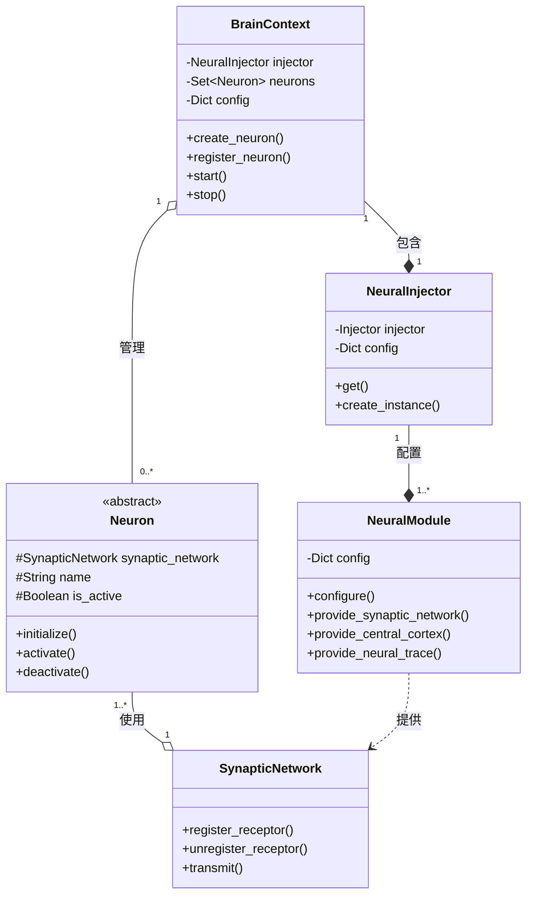
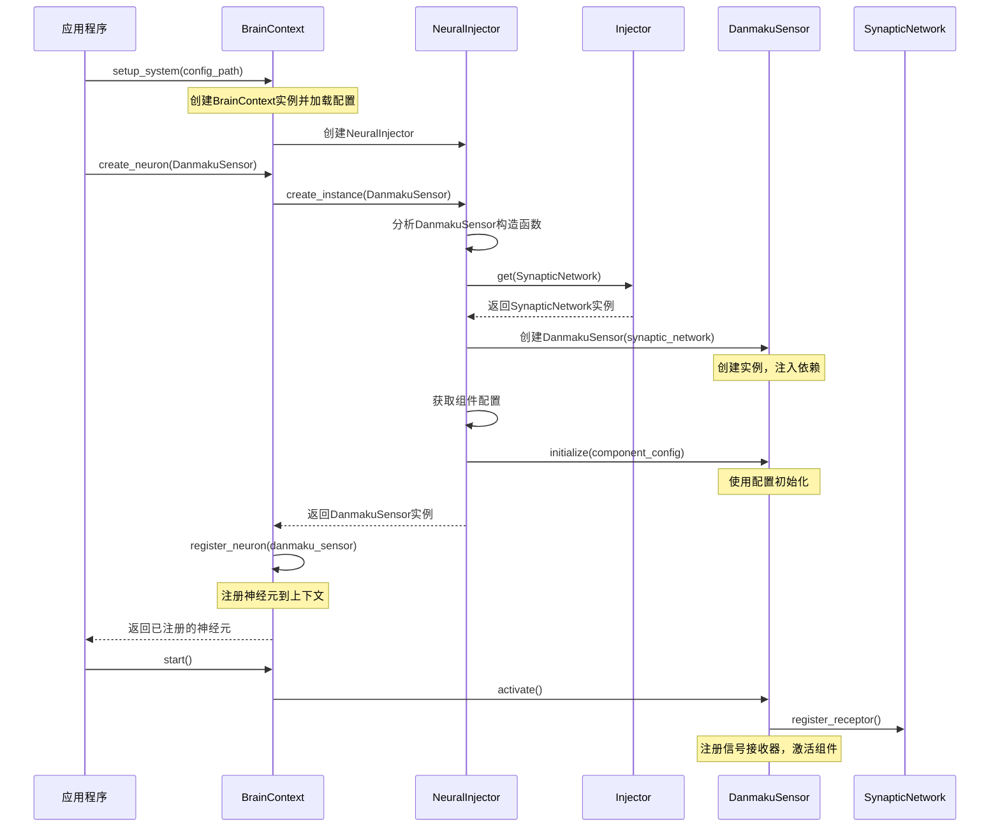
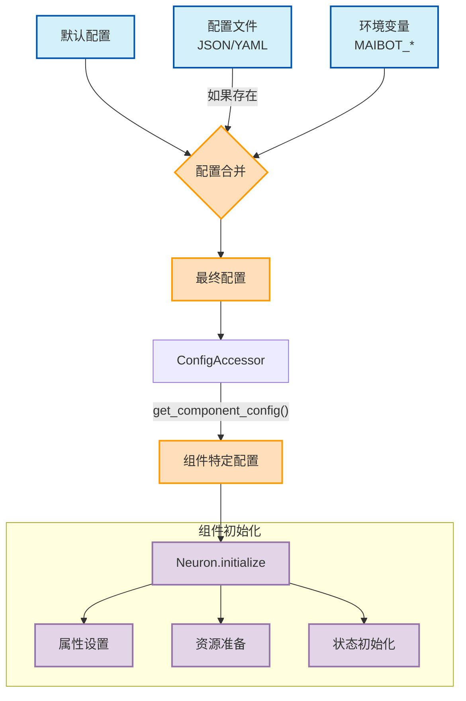
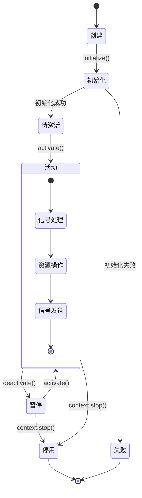

# MaiBot-Vtuber依赖注入系统文档

## 概述

MaiBot-Vtuber项目采用了一套完善的依赖注入系统，通过自动装配组件依赖关系，实现了系统各组件间的松耦合设计。本文档将详细介绍该系统的核心概念、实现方式和使用方法，帮助开发者快速理解项目的依赖管理机制。

## 核心组件

### 1. BrainContext - 思维中枢

`BrainContext`是系统的中央访问点和生命周期管理器，负责：

- 作为系统单例存在，提供全局访问点
- 管理配置加载和分发
- 维护所有神经元组件的生命周期
- 通过`NeuralInjector`提供依赖注入服务

### 2. NeuralInjector - 神经注入器

`NeuralInjector`是依赖注入的核心实现，基于Python的`injector`库构建，主要功能：

- 管理系统组件的依赖关系
- 自动解析和注入组件所需的依赖
- 通过类型标注实现自动装配
- 支持异步组件初始化

### 3. NeuralModule - 神经模块

`NeuralModule`定义了系统组件的提供方式：

- 使用`@provider`和`@singleton`装饰器定义组件提供方式
- 管理系统级别的单例组件
- 提供核心服务的注册点

### 核心组件关系图



## 依赖注入流程

以`main.py`中的`setup_system`函数为例，依赖注入的流程如下：

```python
async def setup_system(config_path: Optional[str] = None) -> BrainContext:
    # 创建大脑上下文
    context = BrainContext(config_path)
    
    # 创建并注册传感器
    danmaku_sensor = await context.create_neuron(DanmakuSensor)
    command_sensor = await context.create_neuron(CommandSensor)
    
    # 创建并注册执行器
    subtitle_actuator = await context.create_neuron(SubtitleActuator)
    live2d_actuator = await context.create_neuron(Live2DActuator)
    
    # 创建并注册MaiBot Core连接器
    core_connector = await context.create_neuron(MaiBotCoreConnector)
    
    return context
```

当调用`context.create_neuron(DanmakuSensor)`时，系统会：

1. 通过`NeuralInjector`解析`DanmakuSensor`的构造函数
2. 自动找到并注入所需的依赖（如`SynapticNetwork`）
3. 创建`DanmakuSensor`实例
4. 调用其`initialize`方法，并传入对应的配置
5. 将其注册到`BrainContext`中

### 依赖注入时序图



## 组件设计规范

为了使用依赖注入系统，组件应遵循以下设计规范：

### 1. 构造函数声明依赖

```python
def __init__(self, synaptic_network: SynapticNetwork, name: Optional[str] = None):
    super().__init__(synaptic_network, name or "弹幕传感器")
```

- 通过类型注解声明依赖
- 系统级依赖会自动注入
- 可选参数应提供默认值

### 2. 实现异步初始化方法

```python
async def _initialize(self, config: Dict[str, Any]) -> None:
    """初始化弹幕传感器
    
    Args:
        config: 配置信息
    """
    self.platform = config.get("platform", "unknown")
    # ...其他初始化代码
```

- 通过`_initialize`方法接收配置
- 使用配置进行组件初始化
- 处理配置缺失的情况

## 配置注入

系统支持多级配置注入：

1. **默认配置**：在代码中硬编码的基础配置
2. **配置文件**：通过JSON或YAML文件提供的配置
3. **环境变量**：以`MAIBOT_`为前缀的环境变量

配置会在组件初始化时自动注入：

```python
# 在NeuralInjector.create_instance中
component_config = self.config_accessor.get_component_config(cls.__name__)
await instance.initialize(component_config)
```

### 配置注入流程图



## 使用示例

### 1. 创建新的神经元组件

```python
from src.neurons.neuron import Neuron
from src.core.synaptic_network import SynapticNetwork

class MyCustomNeuron(Neuron):
    def __init__(self, synaptic_network: SynapticNetwork, name: Optional[str] = None):
        super().__init__(synaptic_network, name or "自定义神经元")
        self.some_property = None
        
    async def _initialize(self, config: Dict[str, Any]) -> None:
        self.some_property = config.get("some_property", "default_value")
        
    async def _register_receptors(self) -> None:
        # 注册信号接收器
        receptor_id = self.synaptic_network.register_receptor(
            signal_type=MySignalType,
            callback=self._handle_signal
        )
        self.receptor_ids.append(receptor_id)
        
    async def _activate(self) -> None:
        # 激活时的逻辑
        pass
        
    async def _deactivate(self) -> None:
        # 停用时的逻辑
        pass
```

### 2. 注册并使用组件

```python
# 在系统初始化代码中
async def setup_my_system():
    context = BrainContext("config.yaml")
    
    # 自动创建并注入依赖
    my_neuron = await context.create_neuron(MyCustomNeuron)
    
    # 启动系统
    await context.start()
```

### 组件生命周期图



## 优势与特点

MaiBot-Vtuber的依赖注入系统具有以下特点：

1. **松耦合**：组件只需声明依赖，无需关心具体实现
2. **自动装配**：通过类型注解自动解析和注入依赖
3. **生命周期管理**：统一管理组件的创建、初始化和销毁
4. **配置集中化**：配置统一管理和分发
5. **异步支持**：原生支持异步初始化和操作
6. **可测试性**：易于进行单元测试和模拟依赖

## 最佳实践

1. **显式声明依赖**：在构造函数中通过类型注解明确声明依赖
2. **使用接口而非实现**：依赖抽象接口而非具体实现
3. **保持构造函数简单**：将复杂初始化逻辑放在`_initialize`方法中
4. **合理设置默认值**：为配置项提供合理的默认值，增强健壮性
5. **异常处理**：在初始化方法中妥善处理异常情况

## 故障排除

如果遇到依赖注入相关问题，请检查：

1. 是否正确声明了依赖的类型注解
2. 依赖是否已在`NeuralModule`中注册
3. 配置文件格式是否正确
4. 组件初始化方法是否正确实现

## 扩展阅读

- 查看`src/core/brain_context.py`了解系统上下文的实现
- 查看`src/core/neural_injector.py`了解依赖注入的核心逻辑
- 查看`src/neurons/neuron.py`了解组件基类设计
