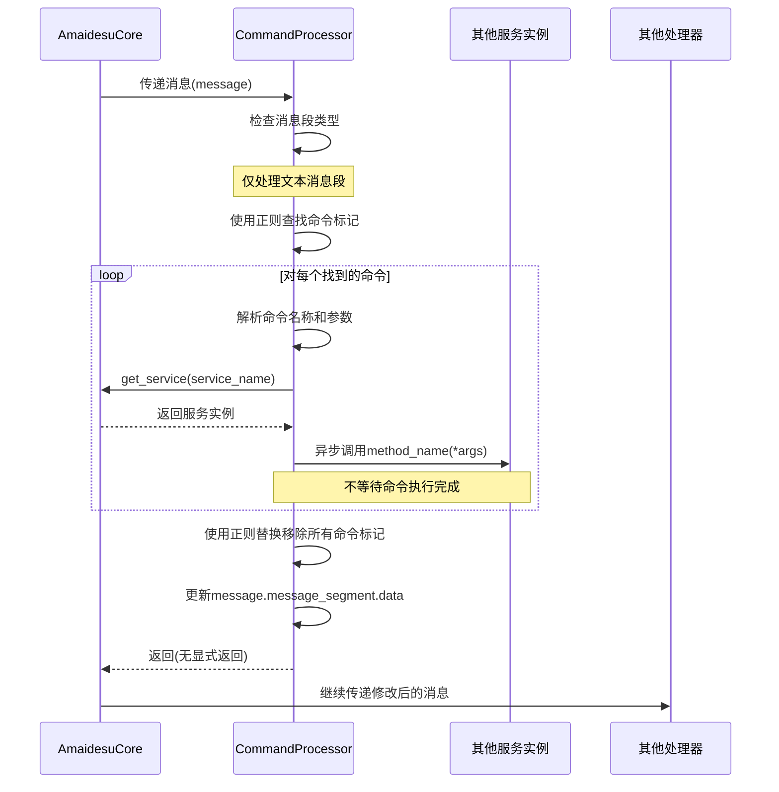

# Command Processor 插件

## 概述
Command Processor 插件是一个用于处理消息中嵌入命令的插件。它能够识别并执行消息中的特殊命令标记（如 `%{command:args}%`），并在消息继续处理前移除这些命令标记。这允许在消息文本中嵌入触发各种功能的指令，而不会影响最终用户看到的输出。

## 工作原理

### 基本流程
1. 插件注册为通配符消息处理器，拦截所有来自 AmaidesuCore 的消息
2. 仅处理文本类型的消息段（message_segment.type == "text"）
3. 使用正则表达式查找消息中的命令模式
4. 提取并异步执行找到的命令（不等待完成）
5. 从消息中移除命令标记
6. 允许修改后的消息继续被其他处理器（如 TTS）处理

### 命令格式
命令使用以下格式：
```
%{command_name:arg1,arg2,...}%
```

例如：
```
%{vts_trigger_hotkey:smile}%
```

### 消息处理流程详解
1. **拦截处理**: 插件通过 `core.register_websocket_handler("*", self.process_message)` 注册为通配符处理器
2. **消息类型检查**: 仅处理含有文本消息段的消息
3. **命令提取**: 使用正则表达式 `command_pattern` 查找所有命令标记
4. **命令解析**: 将命令分解为命令名称和参数列表
5. **服务调用**: 通过 `core.get_service(service_name)` 获取对应服务，调用相应方法
6. **异步执行**: 使用 `asyncio.create_task()` 异步执行命令，不阻塞消息处理流程
7. **标记移除**: 使用正则替换将所有命令标记从消息中移除
8. **继续处理**: 修改后的消息会自然地被传递给其他注册的处理器

### 时序图


## 依赖服务

Command Processor 插件不直接依赖特定的Core服务，但它通过 `core.get_service()` 动态查找并调用其他服务。它所需的服务取决于命令映射中配置的服务名称。

当前硬编码支持的服务包括：
- `vts_control` 服务 (用于 VTubeStudio 控制)

## 核心代码简要讲解

### 插件初始化
```python
def __init__(self, core: AmaidesuCore, plugin_config: Dict[str, Any]):
    # 初始化插件配置
    self.config = plugin_config.get("command_processor", {})
    self.enabled = self.config.get("enabled", True)
    
    # 设置命令匹配模式（正则表达式）
    self.command_pattern_str = self.config.get("command_pattern", r"%\\{([^%{}]+)\\}")
    self.command_pattern = re.compile(self.command_pattern_str)
    
    # 设置命令映射（硬编码）
    self.command_map = {
        "vts_trigger_hotkey": {"service": "vts_control", "method": "trigger_hotkey"},
        # 可添加更多命令
    }
```

### 消息处理逻辑
```python
async def process_message(self, message: MessageBase):
    # 检查消息类型
    if not message.message_segment or message.message_segment.type != "text":
        return
        
    original_text = message.message_segment.data
    commands_found = self.command_pattern.findall(original_text)
    
    # 处理找到的每个命令
    for command_full_match in commands_found:
        parts = command_full_match.strip().split(":", 1)
        command_name = parts[0]
        args_str = parts[1] if len(parts) > 1 else ""
        
        # 查找并执行相应的服务方法
        if command_name in self.command_map:
            command_config = self.command_map[command_name]
            service_instance = self.core.get_service(command_config["service"])
            if service_instance and hasattr(service_instance, command_config["method"]):
                method_to_call = getattr(service_instance, command_config["method"])
                args = [arg.strip() for arg in args_str.split(",") if arg.strip()]
                asyncio.create_task(method_to_call(*args))
    
    # 移除所有命令标记
    processed_text = self.command_pattern.sub("", original_text).strip()
    message.message_segment.data = processed_text
```

## 使用示例

### 在消息中嵌入命令
以下是在其他插件或服务中如何使用Command Processor的示例：

```python
async def generate_response(self, prompt: str):
    # 生成包含命令的响应
    response = f"我现在很开心! %{{vts_trigger_hotkey:smile}}% 你好，世界!"
    
    # 发送到AmaidesuCore进行处理
    # Command Processor会处理命令部分，并在传递给其他处理器前移除命令标记
    await self.core.process_message(response)
    
    # 最终呈现给用户的消息将是: "我现在很开心! 你好，世界!"
    # 同时，VTubeStudio会触发"smile"表情
```

### 添加新命令
要支持新命令，需要在插件的`command_map`中添加新的映射：

```python
self.command_map = {
    "vts_trigger_hotkey": {"service": "vts_control", "method": "trigger_hotkey"},
    "play_sound": {"service": "audio_player", "method": "play"},
    "change_background": {"service": "scene_manager", "method": "set_background"}
}
```

## 开发指南

### 添加新命令
要添加新命令支持，需要：

1. 在 `command_map` 中添加新的命令映射
2. 确保对应的服务已在系统中注册，并且方法已实现
3. 确保方法支持异步调用 (使用 `async def`)
4. 在消息中使用新命令格式：`%{new_command:arg1,arg2}%`

### 注意事项
- 命令处理是异步的，不会阻塞消息处理流程
- 命令执行失败不会影响消息的继续处理
- 所有命令标记都会被从消息中移除，无论执行是否成功
- 默认情况下，命令匹配使用的正则表达式是 `%\\{([^%{}]+)\\}`
- 命令执行通过异步任务进行，插件不等待命令执行完成

## 调试
插件提供了详细的日志记录，可以通过日志级别控制来查看：
- 命令匹配和执行过程
- 错误和警告信息
- 文本处理前后的变化 