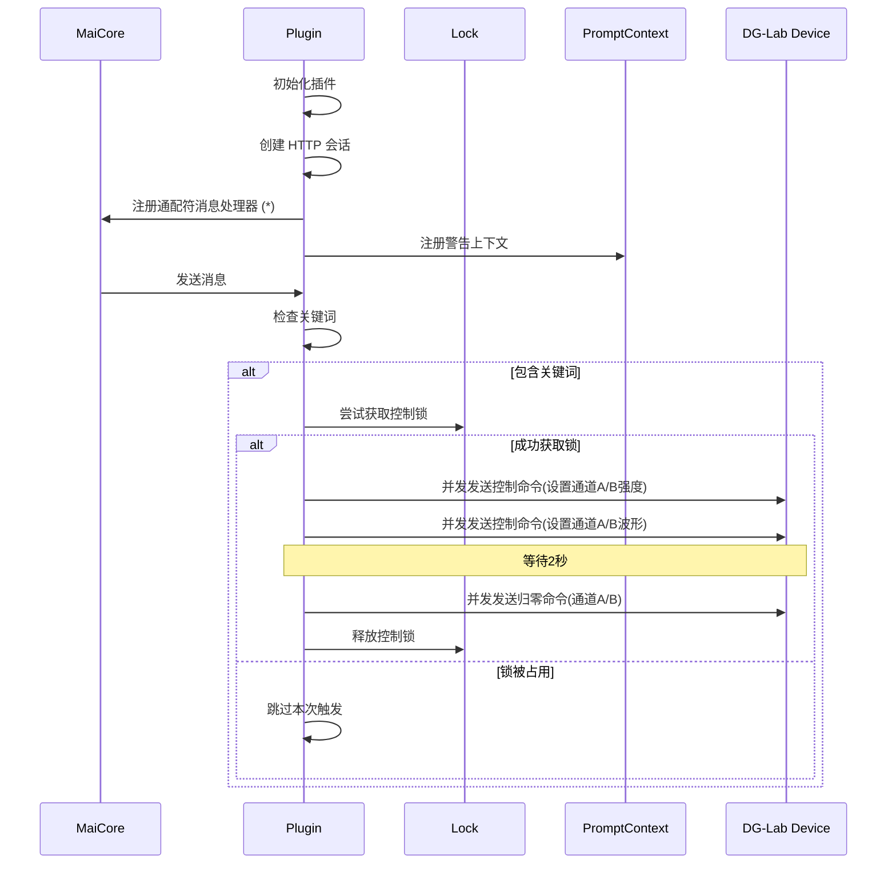

# DG-Lab DO 插件

这是一个用于控制 DG-Lab 设备的插件，当检测到特定关键词时会触发设备控制。

## 功能概述

该插件通过监听所有消息，当消息中包含特定关键词（默认为"电"）时，会自动通过 HTTP API 控制 DG-Lab 设备，设置特定的强度和波形，并在短暂延迟后将强度归零。

## 工作原理

### 核心流程

1. 插件初始化时加载配置并创建 HTTP 会话
2. 注册通配符消息处理器 (`*`) 监听所有传入的消息
3. 向 `prompt_context` 服务注册警告上下文，提醒关键词的后果
4. 当检测到关键词时，通过 HTTP API 并发发送控制命令
5. 等待 2 秒后将设备强度归零

### 消息处理流程

1. `check_and_control_device` 方法接收所有消息
2. 检查消息类型是否为文本并包含关键词 
3. 使用锁机制防止短时间内重复触发大量控制请求
4. 创建异步任务执行设备控制

### 设备控制流程

1. 并发发送四个初始命令（为通道 A 和 B 分别设置强度和波形）
2. 等待 2 秒后并发发送两个归零命令（将通道 A 和 B 强度设为 0）
3. 全程使用错误处理确保稳定运行

### 时序图

## 依赖要求

- aiohttp 库（HTTP 客户端）
- 需要使用 fucking-3.0 项目 (github.com/zzzzzyc/fucking-3.0) 连接郊狼2.0并开启 HTTP API 服务
- 依赖 Core 中的 `prompt_context` 服务（用于注册警告信息）

## 代码实现关键点

### 关键类和方法

- `ElectricityMonitorPlugin`: 插件主类
  - `__init__`: 初始化插件，加载配置和设置初始状态
  - `setup`: 创建 HTTP 会话，注册消息处理器，启动上下文注册任务
  - `_register_context_when_ready`: 尝试向 `prompt_context` 服务注册警告信息
  - `check_and_control_device`: 检查消息并触发控制（主要消息处理入口）
  - `_send_control_commands`: 发送控制命令到设备（主要设备控制逻辑）
  - `_make_api_call`: 负责执行单个 HTTP API 调用并处理错误

### 锁机制和并发控制

插件使用 `asyncio.Lock` 防止短时间内重复触发大量控制请求，同时使用 `asyncio.gather` 实现并发 API 调用，提高响应速度。

### 错误处理与恢复

对 HTTP 请求的所有可能异常进行全面处理，确保即使单个请求失败也不会影响插件整体功能，同时将错误详细记录到日志。

## 注意事项

1. 使用前需要确保 fucking-3.0 项目已正确配置并运行
2. HTTP API 服务必须处于运行状态且能被插件访问
3. 插件会自动向提示系统注册警告信息，提醒用户关键词的后果
4. 使用锁机制防止短时间内重复触发大量控制请求

## 开发说明

### 主要类和方法

- `ElectricityMonitorPlugin`: 插件主类
  - `__init__`: 初始化插件，加载配置
  - `setup`: 创建 HTTP 会话，注册消息处理器
  - `check_and_control_device`: 检查消息并触发控制
  - `_send_control_commands`: 发送控制命令到设备
  - `_make_api_call`: 执行 HTTP API 调用
