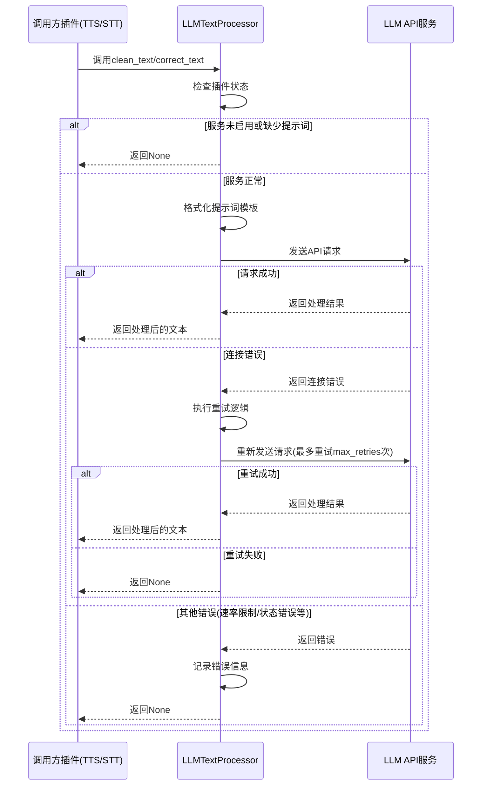

# LLM 文本处理器插件

LLM 文本处理器插件是一个基于大型语言模型(LLM)的文本处理工具，主要用于文本清理和语音识别（STT）结果修正。该插件通过调用兼容OpenAI API接口的LLM模型实现智能文本处理功能。

## 功能特点

- 文本清理：对输入文本进行智能清理和规范化，使其更适合TTS朗读
- STT修正：对语音识别结果进行智能修正，优化识别准确性
- 兼容OpenAI API格式的接口
- 自动重试机制与指数退避策略
- 完善的错误处理和日志记录

## 依赖

- Python 3.11+
- `openai`: OpenAI API Python客户端
- `tomllib`/`toml`: TOML配置文件解析库
- Amaidesu Core

## 工作原理

插件通过以下步骤工作：

1. 初始化时加载插件配置（config.toml）
2. 验证必要的配置项（API URL、密钥等）
3. 初始化OpenAI兼容的API客户端
4. 注册两个核心服务：`text_cleanup`和`stt_correction`
5. 处理请求时，根据服务类型构建不同的提示词
6. 调用LLM API并处理返回结果

## 消息处理流程

1. 其他插件（如TTS或STT插件）调用本插件注册的服务
2. 服务根据调用类型构建相应的提示词
3. 调用`_call_llm`方法发送API请求
4. 处理API响应，包括错误处理和重试逻辑
5. 返回处理结果给调用方

## 服务使用示例

### 使用`text_cleanup`服务（TTS插件示例）

```python
# 获取文本清理服务
cleanup_service = self.core.get_service("text_cleanup")
if cleanup_service:
    # 尝试清理文本
    cleaned = await cleanup_service.clean_text(original_text)
    if cleaned:
        # 使用清理后的文本
        final_text = cleaned
    else:
        # 清理失败，使用原始文本
        self.logger.warning("Cleanup服务调用失败或返回空，使用原始文本。")
```

### 使用`stt_correction`服务（STT插件示例）

```python
# 获取STT修正服务
correction_service = self.core.get_service("stt_correction")
if correction_service:
    # 尝试修正识别结果
    corrected = await correction_service.correct_text(text)
    if corrected and isinstance(corrected, str):
        # 使用修正后的文本
        final_text_to_send = corrected
    else:
        # 修正失败，使用原始文本
        self.logger.info("STT修正服务未返回有效结果，使用原始文本。")
```

## 核心代码解析

### 主要方法说明

#### `clean_text(text: str) -> Optional[str]`
- 功能：清理输入文本，使其更适合TTS朗读
- 实现：应用文本清理提示词模板，并通过LLM服务处理
- 返回：清理后的文本或None（处理失败时）

```python
async def clean_text(self, text: str) -> Optional[str]:
    """Cleans the input text using the cleanup prompt."""
    if not self.enabled or not self.cleanup_prompt:
        self.logger.warning("文本清理功能未启用或缺少Prompt。")
        return None

    prompt = self.cleanup_prompt.format(text=text)
    self.logger.debug(f"请求清理文本: '{text[:50]}...'")
    cleaned = await self._call_llm(prompt)
    if cleaned:
        self.logger.info(f"清理结果: '{cleaned[:50]}...'")
    return cleaned
```

#### `correct_text(text: str) -> Optional[str]`
- 功能：修正STT识别结果，提高准确性和可读性
- 实现：应用STT修正提示词模板，并通过LLM服务处理
- 返回：修正后的文本或None（处理失败时）

```python
async def correct_text(self, text: str) -> Optional[str]:
    """Corrects the input STT result using the correction prompt."""
    if not self.enabled or not self.correction_prompt:
        self.logger.warning("STT修正功能未启用或缺少Prompt。")
        return None

    prompt = self.correction_prompt.format(text=text)
    self.logger.debug(f"请求修正STT: '{text[:50]}...'")
    corrected = await self._call_llm(prompt)
    if corrected:
        self.logger.info(f"修正结果: '{corrected[:50]}...'")
    return corrected
```

#### `_call_llm(prompt: str) -> Optional[str]`
- 功能：内部方法，封装LLM API调用细节
- 实现：使用AsyncOpenAI客户端，处理API错误和重试逻辑
- 特点：实现指数退避重试策略，自动处理常见错误类型
- 返回：LLM响应文本或None（调用失败时）

## 时序图

