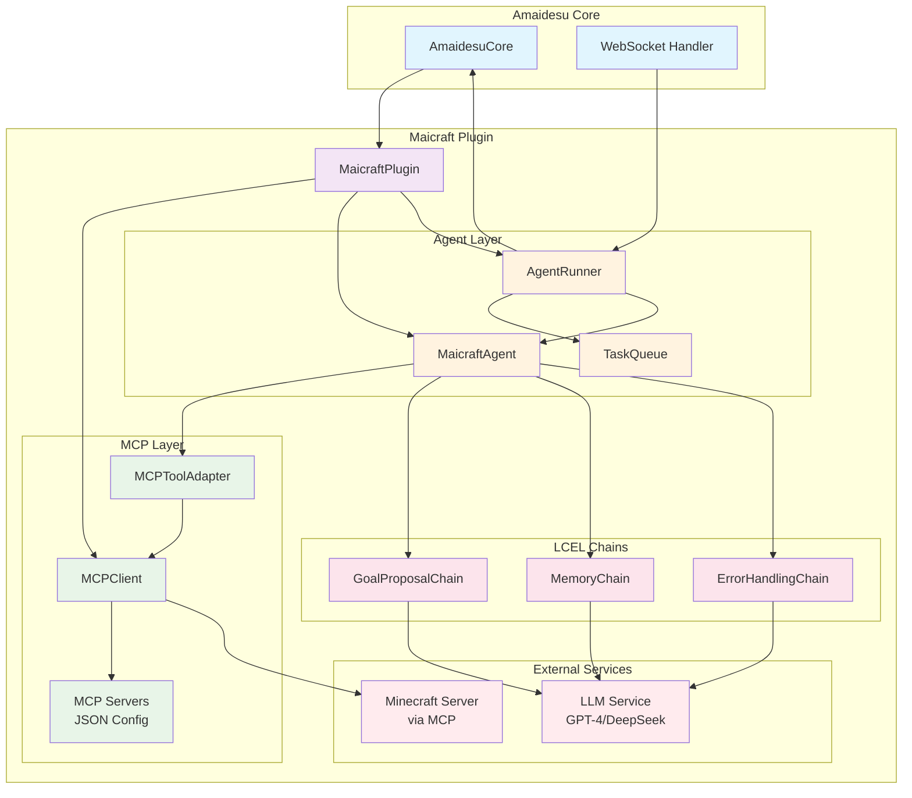
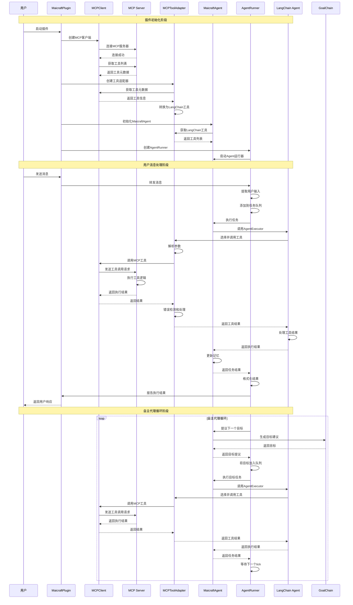
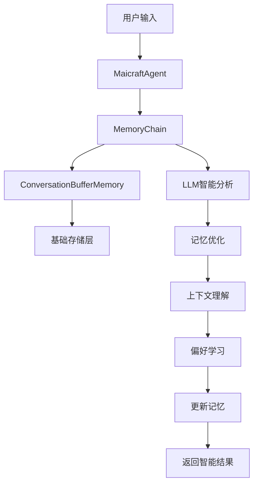

# Maicraft 插件

基于 Model Context Protocol (MCP) 的 Minecraft 智能代理插件。通过 LangChain Agent 和 LCEL (LangChain Expression Language) 进行自然语言理解和任务规划，实现 Minecraft 游戏的自动化控制。

## 🎯 核心特性

- **LangChain Agent**：使用标准的 LangChain Agent 框架，提供更好的可扩展性和稳定性
- **LCEL 链模块化**：基于 LangChain Expression Language 的模块化链设计，支持灵活组合
- **MCP 工具适配器**：自动将 MCP 工具转换为 LangChain Tool，支持动态 Pydantic 模型生成
- **智能规划**：LLM 动态分析任务并选择合适的工具执行
- **自主代理**：支持自主循环，从聊天历史推断并执行目标
- **异步架构**：基于 asyncio 的高性能异步处理
- **类型安全配置**：使用 Pydantic V2 进行配置验证和类型安全
- **错误处理链**：完善的错误检测、恢复和报告机制
- **消息打断功能**：支持用户消息打断正在执行的任务，实现实时响应
- **任务优先级管理**：用户消息具有高优先级，可以打断低优先级的自主任务
- **智能记忆系统**：多层次记忆管理，支持上下文保持和偏好学习
- **架构优化**：删除冗余组件，简化架构，符合LangChain最佳实践
- **智能记忆系统**：多层次记忆管理，支持上下文保持和偏好学习
- **架构优化**：删除冗余组件，简化架构，符合LangChain最佳实践

## 🏗️ 系统架构



### 组件说明

| 组件 | 职责 |
|------|------|
| **MaicraftPlugin** | 插件主入口，负责组件装配和生命周期管理 |
| **MCPClient** | MCP 协议客户端，连接和调用 Minecraft 工具 |
| **MCPToolAdapter** | MCP 工具适配器，将 MCP 工具转换为 LangChain Tool |
| **MaicraftAgent** | 基于 LangChain Agent 的主代理，协调各个 LCEL 链 |
| **AgentRunner** | 代理执行器，处理任务调度和消息响应 |
| **GoalProposalChain** | 目标提议链，生成自主目标 |
| **MemoryChain** | 记忆管理链，处理上下文和聊天历史 |
| **ErrorHandlingChain** | 错误处理链，检测和恢复错误 |
| **TaskQueue** | 任务队列管理器，支持优先级调度和任务打断 |

## 🔄 MCP工具调用流程

### 完整调用时序图



### 核心调用流程详解

#### 1. 插件初始化流程
```python
# MaicraftPlugin.setup()
mcp_client = MCPClient(mcp_config)
connected = await mcp_client.connect()  # 连接MCP服务器
tools_metadata = await mcp_client.get_tools_metadata()  # 获取工具列表
tool_adapter = MCPToolAdapter(mcp_client, config)
langchain_tools = await tool_adapter.create_langchain_tools()  # 转换为LangChain工具
agent = MaicraftAgent(config, mcp_client)
await agent.initialize()  # 初始化Agent
agent_runner = AgentRunner(core, mcp_client, agent, agent_cfg)
await agent_runner.start()  # 启动运行器
```

#### 2. 工具调用流程
```python
# MCPToolAdapter._create_tool_function()
async def tool_function(input_json: str):
    parsed_args = json.loads(input_json)  # 解析参数
    validated_args = self._validate_and_fix_parameters(tool_name, parsed_args)  # 验证参数
    result = await self.mcp_client.call_tool_directly(tool_name, validated_args)  # 调用MCP工具
    return self._process_result(result)  # 处理结果
```

#### 3. MCP客户端工具调用
```python
# MCPClient.call_tool_directly()
async def call_tool_directly(self, tool_name: str, arguments: Dict[str, Any]):
    result = await self._client.call_tool(tool_name, arguments)  # 调用fastmcp
    jsonable_result = self._to_jsonable(result)  # 转换为JSON格式
    return {"success": True, "result": jsonable_result}
```

#### 4. Agent执行流程
```python
# MaicraftAgent.plan_and_execute()
result = await self.agent_executor.ainvoke({
    "input": user_input, 
    "chat_history": self.get_chat_history()
})  # 使用LangChain Agent执行
```

## 🧠 记忆系统架构

### 多层次记忆架构



### 记忆组件关系

#### 1. ConversationBufferMemory (基础存储)
```python
# 职责：原始数据存储
self.memory = ConversationBufferMemory(
    memory_key="chat_history", 
    return_messages=True
)
```

**特点**：
- **简单存储**：只负责存储和检索原始对话数据
- **无智能处理**：不进行数据分析或优化
- **LangChain标准**：符合LangChain框架标准

#### 2. MemoryChain (智能管理)
```python
# 职责：智能记忆处理
self.memory_chain = MemoryChain(self.llm, self.memory)
```

**特点**：
- **智能分析**：使用LLM分析记忆内容
- **记忆优化**：压缩和优化记忆存储
- **上下文理解**：提取重要信息和用户偏好

### 记忆工作流程

#### 1. 任务执行时的记忆传递
```python
async def plan_and_execute(self, user_input: str) -> Dict[str, Any]:
    # 1. 获取聊天历史
    chat_history = self.get_chat_history()
    
    # 2. 传递给Agent执行器（自动记忆管理）
    result = await self.agent_executor.ainvoke({
        "input": user_input, 
        "chat_history": chat_history  # 自动更新记忆
    })
    
    # 3. 手动更新记忆
    await self._update_memory(user_input, formatted_result)
```

#### 2. 智能记忆更新
```python
async def _update_memory(self, user_input: str, result: Dict[str, Any]):
    """更新记忆"""
    if self.memory_chain:
        memory_data = {
            "current_memory": "",
            "new_information": f"用户输入: {user_input}, 执行结果: {result}",
            "memory_type": "task_execution",
            "memory_limits": {"max_tokens": self.config.langchain.max_token_limit},
        }
        await self.memory_chain.execute(memory_data)
```

### 记忆系统特性

1. **上下文保持**：维护完整的对话历史，提供连贯的用户体验
2. **智能分析**：使用LLM分析记忆内容，提取重要信息
3. **自动优化**：智能压缩和优化记忆，控制资源使用
4. **偏好学习**：学习用户偏好，提供个性化服务
5. **错误恢复**：记忆操作失败不影响主要功能
6. **灵活配置**：支持记忆大小限制和优化策略配置

## 🤖 Agent架构优化

### MaicraftAgent和AgentRunner的关系

#### 职责分工

**MaicraftAgent：智能决策核心**
```python
class MaicraftAgent:
    """基于LangChain Agent的Minecraft Agent"""
    
    # 核心职责：
    # 1. 管理LLM和工具
    # 2. 提供智能决策能力
    # 3. 执行具体的任务规划
    # 4. 管理记忆和上下文
```

**AgentRunner：任务调度和生命周期管理**
```python
class AgentRunner:
    """简化的Agent运行器，专注于任务调度"""
    
    # 核心职责：
    # 1. 任务队列管理
    # 2. 生命周期控制
    # 3. 消息处理
    # 4. 自主代理循环
```

#### 协作模式

```python
# AgentRunner调用MaicraftAgent
async def _execute_task(self, task: RunnerTask) -> Dict[str, Any]:
    """执行具体任务"""
    # Runner委托给Agent执行
    result = await self.agent.plan_and_execute(task.goal)
    return result

async def _propose_and_execute_goal(self):
    """提议并执行目标"""
    # Runner使用Agent的目标提议能力
    goal = await self.agent.propose_next_goal()
    if goal:
        await self.task_queue.enqueue_goal_with_split(
            goal=goal, priority=self.task_queue.PRIORITY_NORMAL, source="auto"
        )
```

### 架构设计优势

1. **职责分离**：
   - MaicraftAgent：专注智能决策
   - AgentRunner：专注任务调度

2. **可扩展性**：
   - 可以替换不同的Agent实现
   - 可以增强AgentRunner的调度功能

3. **错误隔离**：
   - Agent执行失败不影响Runner
   - Runner可以处理Agent的错误

4. **并发安全**：
   - AgentRunner处理并发任务调度
   - MaicraftAgent专注于单次任务执行

## 🔄 MCP工具调用流程

### 完整调用时序图


### 核心调用流程详解

#### 1. 插件初始化流程
```python
# MaicraftPlugin.setup()
mcp_client = MCPClient(mcp_config)
connected = await mcp_client.connect()  # 连接MCP服务器
tools_metadata = await mcp_client.get_tools_metadata()  # 获取工具列表
tool_adapter = MCPToolAdapter(mcp_client, config)
langchain_tools = await tool_adapter.create_langchain_tools()  # 转换为LangChain工具
agent = MaicraftAgent(config, mcp_client)
await agent.initialize()  # 初始化Agent
agent_runner = AgentRunner(core, mcp_client, agent, agent_cfg)
await agent_runner.start()  # 启动运行器
```

#### 2. 工具调用流程
```python
# MCPToolAdapter._create_tool_function()
async def tool_function(input_json: str):
    parsed_args = json.loads(input_json)  # 解析参数
    validated_args = self._validate_and_fix_parameters(tool_name, parsed_args)  # 验证参数
    result = await self.mcp_client.call_tool_directly(tool_name, validated_args)  # 调用MCP工具
    return self._process_result(result)  # 处理结果
```

#### 3. MCP客户端工具调用
```python
# MCPClient.call_tool_directly()
async def call_tool_directly(self, tool_name: str, arguments: Dict[str, Any]):
    result = await self._client.call_tool(tool_name, arguments)  # 调用fastmcp
    jsonable_result = self._to_jsonable(result)  # 转换为JSON格式
    return {"success": True, "result": jsonable_result}
```

#### 4. Agent执行流程
```python
# MaicraftAgent.plan_and_execute()
result = await self.agent_executor.ainvoke({
    "input": user_input, 
    "chat_history": self.get_chat_history()
})  # 使用LangChain Agent执行
```

## 🧠 记忆系统架构

### 多层次记忆架构


### 记忆组件关系

#### 1. ConversationBufferMemory (基础存储)
```python
# 职责：原始数据存储
self.memory = ConversationBufferMemory(
    memory_key="chat_history", 
    return_messages=True
)
```

**特点**：
- **简单存储**：只负责存储和检索原始对话数据
- **无智能处理**：不进行数据分析或优化
- **LangChain标准**：符合LangChain框架标准

#### 2. MemoryChain (智能管理)
```python
# 职责：智能记忆处理
self.memory_chain = MemoryChain(self.llm, self.memory)
```

**特点**：
- **智能分析**：使用LLM分析记忆内容
- **记忆优化**：压缩和优化记忆存储
- **上下文理解**：提取重要信息和用户偏好

### 记忆工作流程

#### 1. 任务执行时的记忆传递
```python
async def plan_and_execute(self, user_input: str) -> Dict[str, Any]:
    # 1. 获取聊天历史
    chat_history = self.get_chat_history()
    
    # 2. 传递给Agent执行器（自动记忆管理）
    result = await self.agent_executor.ainvoke({
        "input": user_input, 
        "chat_history": chat_history  # 自动更新记忆
    })
    
    # 3. 手动更新记忆
    await self._update_memory(user_input, formatted_result)
```

#### 2. 智能记忆更新
```python
async def _update_memory(self, user_input: str, result: Dict[str, Any]):
    """更新记忆"""
    if self.memory_chain:
        memory_data = {
            "current_memory": "",
            "new_information": f"用户输入: {user_input}, 执行结果: {result}",
            "memory_type": "task_execution",
            "memory_limits": {"max_tokens": self.config.langchain.max_token_limit},
        }
        await self.memory_chain.execute(memory_data)
```

### 记忆系统特性

1. **上下文保持**：维护完整的对话历史，提供连贯的用户体验
2. **智能分析**：使用LLM分析记忆内容，提取重要信息
3. **自动优化**：智能压缩和优化记忆，控制资源使用
4. **偏好学习**：学习用户偏好，提供个性化服务
5. **错误恢复**：记忆操作失败不影响主要功能
6. **灵活配置**：支持记忆大小限制和优化策略配置

## 🤖 Agent架构优化

### MaicraftAgent和AgentRunner的关系

#### 职责分工

**MaicraftAgent：智能决策核心**
```python
class MaicraftAgent:
    """基于LangChain Agent的Minecraft Agent"""
    
    # 核心职责：
    # 1. 管理LLM和工具
    # 2. 提供智能决策能力
    # 3. 执行具体的任务规划
    # 4. 管理记忆和上下文
```

**AgentRunner：任务调度和生命周期管理**
```python
class AgentRunner:
    """简化的Agent运行器，专注于任务调度"""
    
    # 核心职责：
    # 1. 任务队列管理
    # 2. 生命周期控制
    # 3. 消息处理
    # 4. 自主代理循环
```

#### 协作模式

```python
# AgentRunner调用MaicraftAgent
async def _execute_task(self, task: RunnerTask) -> Dict[str, Any]:
    """执行具体任务"""
    # Runner委托给Agent执行
    result = await self.agent.plan_and_execute(task.goal)
    return result

async def _propose_and_execute_goal(self):
    """提议并执行目标"""
    # Runner使用Agent的目标提议能力
    goal = await self.agent.propose_next_goal()
    if goal:
        await self.task_queue.enqueue_goal_with_split(
            goal=goal, priority=self.task_queue.PRIORITY_NORMAL, source="auto"
        )
```

### 架构设计优势

1. **职责分离**：
   - MaicraftAgent：专注智能决策
   - AgentRunner：专注任务调度

2. **可扩展性**：
   - 可以替换不同的Agent实现
   - 可以增强AgentRunner的调度功能

3. **错误隔离**：
   - Agent执行失败不影响Runner
   - Runner可以处理Agent的错误

4. **并发安全**：
   - AgentRunner处理并发任务调度
   - MaicraftAgent专注于单次任务执行

## 🔄 工作流程

## 🚀 快速开始

### 1. 环境准备

```bash
# 安装依赖
pip install fastmcp langchain langchain-openai

# 启动 Minecraft 1.21.5（仅支持1.21.5及以下版本）
# 创建世界并开启局域网模式（端口25565）
```

### 2. 部署 MCP 服务器

**推荐使用 [ChangingSelf/Maicraft](https://github.com/ChangingSelf/Maicraft) 作为 Minecraft MCP 服务器**

这是一个专门为 MaiBot 开发的 Minecraft MCP 服务器，具有以下优势：

- ✅ **专门优化**：为 MaiBot 场景专门设计和优化
- ✅ **功能丰富**：支持多种 Minecraft 操作和查询
- ✅ **稳定可靠**：经过充分测试，生产环境可用
- ✅ **易于配置**：提供详细的配置文档和示例
- ✅ **活跃维护**：持续更新和改进

#### 方式一：使用 npx（推荐）

```bash
# 直接使用 npx 运行，无需本地安装
npx maicraft --help
```

#### 方式二：源码安装

```bash
# 1. 克隆项目到本地
git clone https://github.com/ChangingSelf/Maicraft.git
cd Maicraft

# 2. 安装依赖
pnpm install

# 3. 构建项目
pnpm build

# 4. 创建配置文件
cp config-template.yaml config.yaml
# 编辑 config.yaml 配置 Minecraft 服务器连接信息
```

#### 配置 Maicraft MCP 服务器

创建配置文件 `config.yaml`：

```yaml
minecraft:
  host: 127.0.0.1        # Minecraft 服务器地址
  port: 25565            # 端口
  username: MaiBot       # 机器人用户名
  auth: offline          # 认证方式：offline | microsoft | mojang
  version: "1.19.0"      # 游戏版本

enabledEvents:
  - chat                 # 聊天事件
  - playerJoin           # 玩家加入
  - playerLeave          # 玩家离开
  - blockBreak           # 方块破坏
  - blockPlace           # 方块放置

maxMessageHistory: 100   # 事件历史缓存数量

logging:
  level: INFO            # DEBUG | INFO | WARN | ERROR
  enableFileLog: true    # 是否启用文件日志
  useStderr: true        # 是否使用 stderr 输出（MCP 模式建议保持 true）
```

#### 验证部署

```bash
# 使用 npx 测试
npx maicraft --host 127.0.0.1 --port 25565 --username MaiBot

# 或使用源码运行
pnpm start
```

### 3. 备选方案

如果无法使用 Maicraft，也可以使用 [yuniko-software/minecraft-mcp-server](https://github.com/yuniko-software/minecraft-mcp-server) 作为备选方案。

> ⚠️ **重要提示**: yuniko-software/minecraft-mcp-server 仅支持 Minecraft 1.21.5 及以下版本

### 3. 配置插件

创建配置文件 `config/maicraft.toml`：

```toml
[llm]
model = "gpt-4o-mini"
api_key = ""                    # 留空使用环境变量 OPENAI_API_KEY
base_url = ""                   # 可选：自定义API地址
temperature = 0.2

[agent]
enabled = true                  # 启用自主代理
session_id = "maicraft_default" # 会话ID
max_steps = 50                  # 任务最大执行步数
tick_seconds = 8.0              # 自主循环间隔
report_each_step = true         # 是否报告每个步骤

[langchain]
max_token_limit = 4000          # 最大token限制
verbose = false                 # 是否启用详细日志
early_stopping_method = "generate" # 早期停止方法
handle_parsing_errors = true    # 是否处理解析错误

[error_detection]
mode = "full_json"              # 错误检测模式: full_json 或 custom_keys
error_keys = {success = false, ok = false, error = true, failed = true}
error_message_keys = ["error_message", "error", "message", "reason"]
error_code_keys = ["error_code", "code", "status_code"]
```

### 4. 配置 MCP 服务器

编辑 `mcp/mcp_servers.json`，配置 Maicraft MCP 服务器：

#### 方式一：使用 npx（推荐）

```json
{
  "mcpServers": {
    "maicraft": {
      "type": "stdio",
      "command": "npx",
      "args": ["-y", "maicraft", "./config.yaml"]
    }
  }
}
```

或者使用命令行参数覆盖配置：

```json
{
  "mcpServers": {
    "maicraft": {
      "type": "stdio",
      "command": "npx",
      "args": ["-y", "maicraft", "--host", "127.0.0.1", "--port", "25565", "--username", "MaiBot", "--auth", "offline"]
    }
  }
}
```

#### 方式二：源码安装

```json
{
  "mcpServers": {
    "maicraft": {
      "type": "stdio",
      "command": "node",
      "args": ["/path/to/maicraft/dist/main.js", "/path/to/maicraft/config.yaml"]
    }
  }
}
```

开发阶段也可以直接运行 TypeScript 源码：

```json
{
  "mcpServers": {
    "maicraft": {
      "type": "stdio",
      "command": "tsx",
      "args": ["/path/to/maicraft/src/main.ts", "/path/to/maicraft/config.yaml"]
    }
  }
}
```

### 5. 启动使用

启动 Amaidesu 后，插件会自动：
- 连接到 Maicraft MCP 服务器
- MCP 服务器连接到 Minecraft 游戏
- 监听直播间消息
- 执行 Minecraft 相关指令
- 进行自主探索和建造

#### 启动检查清单

确保以下条件都满足：
- ✅ Minecraft 游戏正在运行（支持多个版本）
- ✅ 游戏世界已开启局域网模式（端口25565）
- ✅ Maicraft MCP 服务器已正确配置
- ✅ mcp_servers.json 中的配置正确
- ✅ Amaidesu 主程序已启动

#### 可用的 MCP 工具

Maicraft 提供丰富的 MCP 工具：

**查询工具：**
- `query_state` - 查询游戏状态
- `query_events` - 查询事件历史

**动作工具：**
- `chat` - 发送聊天消息
- `mine_block` - 挖掘方块
- `place_block` - 放置方块
- `craft_item` - 合成物品
- `smelt_item` - 熔炼物品
- `use_chest` - 使用箱子
- `swim_to_land` - 游向陆地
- `kill_mob` - 击杀生物
- `follow_player` - 跟随玩家

## 🔧 配置说明

### LLM 配置

| 参数 | 类型 | 默认值 | 说明 |
|------|------|--------|------|
| `model` | string | "gpt-4o-mini" | LLM 模型名称 |
| `api_key` | string | None | API 密钥（留空使用环境变量） |
| `base_url` | string | None | 自定义 API 地址 |
| `temperature` | float | 0.2 | 温度参数 (0.0-2.0) |

### Agent 配置

| 参数 | 类型 | 默认值 | 说明 |
|------|------|--------|------|
| `enabled` | boolean | true | 是否启用自主代理 |
| `session_id` | string | "maicraft_default" | 会话标识符 |
| `max_steps` | integer | 50 | 任务最大执行步数 (1-100) |
| `tick_seconds` | float | 8.0 | 自主循环间隔 (1.0-60.0) |
| `report_each_step` | boolean | true | 是否报告每个步骤 |

### LangChain 配置

| 参数 | 类型 | 默认值 | 说明 |
|------|------|--------|------|
| `max_token_limit` | integer | 4000 | 最大 token 限制 (1000-8000) |
| `verbose` | boolean | false | 是否启用详细日志 |
| `early_stopping_method` | string | "generate" | 早期停止方法 |
| `handle_parsing_errors` | boolean | true | 是否处理解析错误 |

### 错误检测配置

| 参数 | 类型 | 默认值 | 说明 |
|------|------|--------|------|
| `mode` | string | "full_json" | 错误检测模式 |
| `error_keys` | object | {...} | 错误检测字段映射 |
| `error_message_keys` | array | [...] | 错误消息字段列表 |
| `error_code_keys` | array | [...] | 错误代码字段列表 |

## 🔄 LCEL 链架构

### 链模块设计

```
chains/
├── base.py                    # 基础链类
├── goal_proposal_chain.py     # 目标提议链
├── memory_chain.py            # 记忆管理链
└── error_handling_chain.py    # 错误处理链
```

### 链功能说明

#### GoalProposalChain（目标提议链）
- **上下文分析**：分析聊天历史和当前状态
- **目标生成**：基于上下文生成潜在目标
- **可行性验证**：验证目标的可行性和优先级

#### MemoryChain（记忆管理链）
- **记忆加载**：从存储中加载历史记忆
- **记忆更新**：更新当前对话和状态信息
- **记忆保存**：将更新后的记忆保存到存储
- **智能分析**：使用LLM分析记忆内容，提取重要信息
- **记忆优化**：压缩和优化记忆存储，控制token使用量

#### ErrorHandlingChain（错误处理链）
- **错误检测**：检测工具调用和LLM响应中的错误
- **错误恢复**：尝试自动恢复或提供替代方案
- **错误报告**：生成详细的错误报告和日志

### 链使用情况

| 链名称 | 使用状态 | 用途 |
|--------|----------|------|
| **GoalProposalChain** | ✅ 使用中 | 自主目标提议 |
| **MemoryChain** | ✅ 使用中 | 智能记忆管理 |
| **ErrorHandlingChain** | ✅ 使用中 | 错误处理和恢复 |
| ~~TaskPlanningChain~~ | ❌ 已删除 | ~~任务规划~~（由LangChain内置Agent替代） |

## 🎯 消息打断功能

### 功能说明
重构后的 AgentRunner 支持用户消息打断正在执行的任务，实现实时响应：

1. **优先级管理**：
   - 用户消息：高优先级（PRIORITY_MAICORE = 0）
   - 自主任务：低优先级（PRIORITY_NORMAL = 10）

2. **打断机制**：
   - 检测到新用户消息时，自动取消当前正在执行的任务
   - 立即开始处理用户的新指令
   - 向用户报告任务取消状态

3. **任务队列**：
   - 使用 TaskQueue 进行优先级调度
   - 支持任务拆分和组合
   - 提供任务状态监控

### 使用示例

```python
# 用户发送消息时，系统会自动：
# 1. 检查是否有正在执行的任务
# 2. 如果有，取消当前任务
# 3. 将用户消息作为高优先级任务加入队列
# 4. 立即开始处理用户指令

# 日志示例：
# [AgentRunner] 收到消息: chat
# [AgentRunner] 检测到新消息，准备打断当前任务
# [AgentRunner] 正在打断当前任务
# [AgentRunner] 当前任务已成功取消
# [AgentRunner] 用户任务已添加到队列: 帮我挖10个石头
```

## 🛠️ 开发指南

### 添加新的 LCEL 链

1. 在 `chains/` 目录下创建新的链文件
2. 继承 `BaseChain` 类并实现必要的方法
3. 在 `MaicraftAgent` 中集成新链

```python
from .base import BaseChain

class CustomChain(BaseChain):
    def __init__(self, name: str):
        super().__init__(name)
    
    def build(self) -> Runnable:
        # 构建LCEL链
        pass
    
    async def execute(self, input_data: Dict[str, Any]) -> Dict[str, Any]:
        # 执行链逻辑
        pass
```

### 扩展 MCP 工具支持

工具适配器会自动处理新的 MCP 工具，无需额外配置。工具会：
- 自动生成 Pydantic 模型
- 提供类型安全的参数验证
- 包含详细的错误处理
- 支持异步调用

### 配置验证

使用 Pydantic V2 进行配置验证：

```python
from src.plugins.maicraft.config import MaicraftConfig

# 创建配置实例
config = MaicraftConfig(
    llm=LLMConfig(model="gpt-4o-mini"),
    agent=AgentConfig(enabled=True)
)

# 验证配置
config.validate_and_log()
```

## 🐛 故障排除

### 常见问题

1. **MCP 连接失败**
   - 检查 Minecraft 服务器是否运行
   - 验证 Maicraft MCP 服务器配置
   - 确认端口和地址设置
   - 检查 `config.yaml` 配置是否正确

2. **Maicraft 服务器启动失败**
   - 确保已安装 Node.js 和 pnpm
   - 检查 Minecraft 服务器版本兼容性
   - 验证认证方式配置（offline/microsoft/mojang）
   - 查看 Maicraft 日志文件排查问题

3. **LLM 调用失败**
   - 检查 API 密钥配置
   - 验证网络连接
   - 确认模型名称正确

4. **工具调用错误**
   - 查看错误处理链日志
   - 检查 MCP 工具状态
   - 验证参数格式
   - 确认 Maicraft 工具是否可用

5. **记忆系统问题**
   - 检查记忆链初始化状态
   - 验证LLM服务连接
   - 查看记忆更新日志
   - 确认token限制配置

### 日志调试

启用详细日志：

```toml
[langchain]
verbose = true
```

查看关键日志：
- `[MCP工具适配器]` - MCP 工具转换日志
- `[MaicraftAgent]` - Agent 执行日志
- `[MemoryChain]` - 记忆管理日志
- `[ErrorHandlingChain]` - 错误处理日志
- `[AgentRunner]` - 任务调度日志

## 📝 更新日志

### v2.1.0 (架构优化版本)
- ✅ 删除未使用的TaskPlanningChain，简化架构
- ✅ 优化LCEL链使用，只保留实际使用的链
- ✅ 增强类型安全性，添加空值检查
- ✅ 完善记忆系统文档和说明
- ✅ 优化Agent架构，明确MaicraftAgent和AgentRunner职责
- ✅ 符合LangChain最佳实践，提高代码质量
- ✅ 减少代码冗余，提高维护性
- ✅ 完善MCP工具调用流程文档

### v2.0.0 (重构版本)
- ✅ 使用 LangChain Agent 替代自定义 LLMPlanner
- ✅ 实现 LCEL 链模块化架构
- ✅ 添加 MCP 工具适配器
- ✅ 升级到 Pydantic V2
- ✅ 完善错误处理和恢复机制
- ✅ 优化配置验证和类型安全
- ✅ 简化代码结构，提高可维护性
- ✅ 集成 TaskQueue 优先级管理
- ✅ 实现消息打断功能，支持实时响应
- ✅ 优先推荐使用 [ChangingSelf/Maicraft](https://github.com/ChangingSelf/Maicraft) 作为 MCP 服务器

### v0.x.x (原版本)
- 基础 MCP 集成
- 自定义 LLM 规划器
- 简单的任务队列管理
