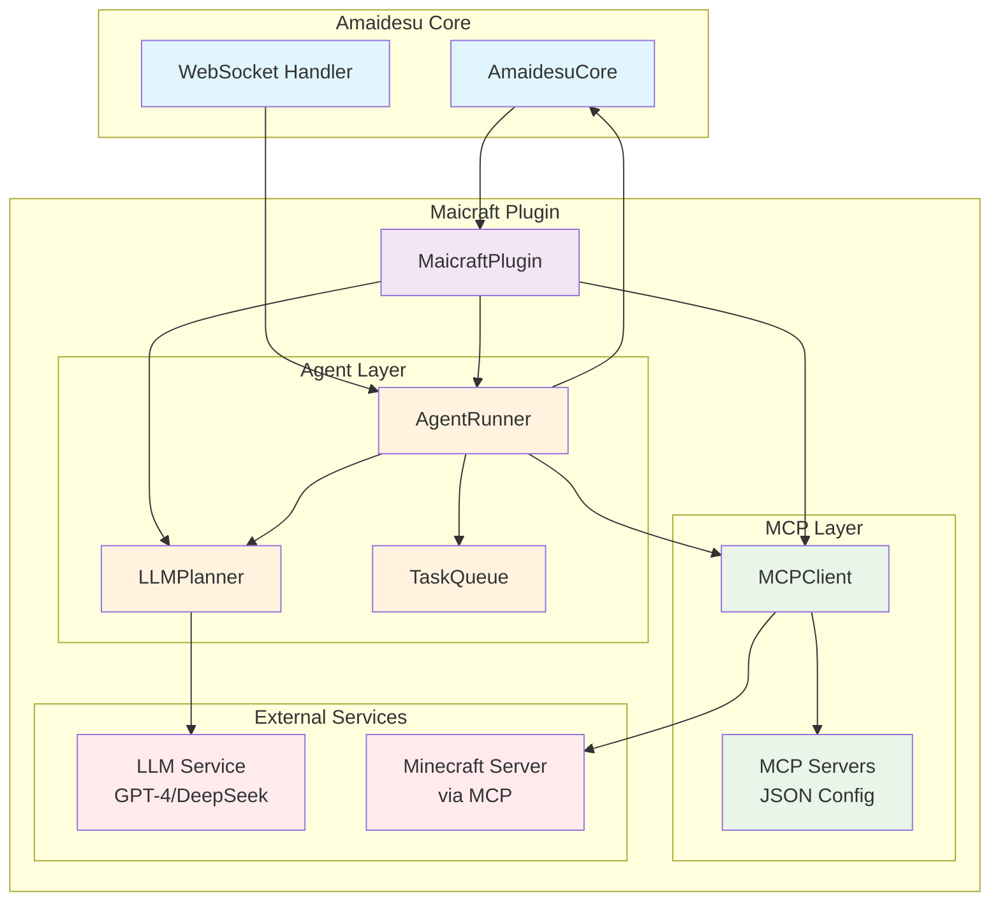
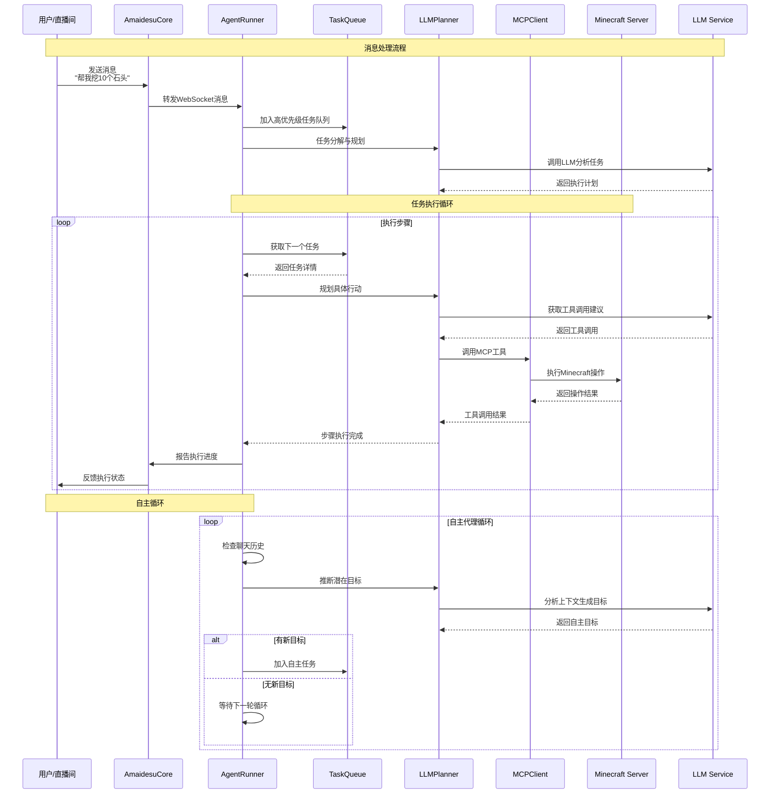

# Maicraft 插件

基于 Model Context Protocol (MCP) 的 Minecraft 智能代理插件。通过 LLM 进行自然语言理解和任务规划，实现 Minecraft 游戏的自动化控制。

## 🎯 核心特性

- **智能规划**：LLM 动态分析任务并选择合适的工具执行
- **自主代理**：支持自主循环，从聊天历史推断并执行目标
- **异步架构**：基于 asyncio 的高性能异步处理
- **灵活配置**：通过 MCP JSON 配置连接不同的 Minecraft 服务器

## 🏗️ 系统架构



### 组件说明

| 组件 | 职责 |
|------|------|
| **MaicraftPlugin** | 插件主入口，负责组件装配和生命周期管理 |
| **MCPClient** | MCP 协议客户端，连接和调用 Minecraft 工具 |
| **AgentRunner** | 代理执行器，处理任务调度和消息响应 |
| **LLMPlanner** | LLM 规划器，负责任务分解和工具选择 |
| **TaskQueue** | 任务队列管理器，支持优先级调度 |

## 📊 工作流程



## 🚀 快速开始

### 1. 环境准备

```bash
# 安装依赖
pip install fastmcp

# 启动 Minecraft 1.21.5（仅支持1.21.5及以下版本）
# 创建世界并开启局域网模式（端口25565）
```

### 2. 部署 MCP 服务器

测试的时候可以使用 [yuniko-software/minecraft-mcp-server](https://github.com/yuniko-software/minecraft-mcp-server) 作为 Minecraft MCP 服务器。

> ⚠️ **重要提示**: 该服务器仅支持 Minecraft 1.21.5 及以下版本

#### 本地部署步骤

```bash
# 1. 克隆项目到本地
git clone https://github.com/yuniko-software/minecraft-mcp-server.git
cd minecraft-mcp-server

# 2. 安装依赖
npm install

# 3. 编译项目
npm run build

# 4. 记录项目的绝对路径，后续配置需要使用
pwd  # 复制输出的路径
```

#### 验证部署

```bash
# 测试服务器是否可以正常启动
npx .
```

### 3. 配置插件

创建配置文件 `config/maicraft.toml`：

```toml
[llm]
model = "gpt-4o-mini"
api_key = ""                    # 留空使用环境变量 OPENAI_API_KEY
base_url = ""                   # 可选：自定义API地址
temperature = 0.2

[agent]
enabled = true                  # 启用自主代理
max_steps = 50                  # 任务最大执行步数
tick_seconds = 8.0              # 自主循环间隔
```

### 4. 配置 MCP 服务器

编辑 `mcp/mcp_servers.json`，使用本地部署的服务器：

```json
{
  "mcpServers": {
    "minecraft": {
      "command": "npx",
      "args": [
        "/path/to/minecraft-mcp-server",
        "--host", "localhost",
        "--port", "25565",
        "--username", "MaiBot"
      ]
    }
  }
}
```

> 📝 **配置说明**: 
> - 将 `/path/to/minecraft-mcp-server` 替换为步骤2中记录的实际路径
> - 确保 `--port` 与 Minecraft 局域网端口一致
> - 可以自定义 `--username` 为你喜欢的机器人名称

#### 配置示例

假设你将项目克隆到了 `D:\minecraft-mcp-server`，配置应该是：

```json
{
  "mcpServers": {
    "minecraft": {
      "command": "npx",
      "args": [
        "D:\\minecraft-mcp-server",
        "--host", "localhost",
        "--port", "25565",
        "--username", "MaiBot"
      ]
    }
  }
}
```

### 5. 启动使用

启动 Amaidesu 后，插件会自动：
- 连接到本地部署的 MCP 服务器
- MCP 服务器连接到 Minecraft 游戏
- 监听直播间消息
- 执行 Minecraft 相关指令
- 进行自主探索和建造

#### 启动检查清单

确保以下条件都满足：
- ✅ Minecraft 1.21.5 游戏正在运行
- ✅ 游戏世界已开启局域网模式（端口25565）
- ✅ minecraft-mcp-server 已成功编译
- ✅ mcp_servers.json 中的路径配置正确
- ✅ Amaidesu 主程序已启动

## 💬 使用示例

MaiBot Core可以发送自然语言指令：

- "帮我挖10个石头"
- "建造一个小房子"
- "去找一些食物"
- "探索附近的洞穴"

插件会自动理解指令并在 Minecraft 中执行相应操作。

## ⚙️ 高级配置

### 任务优先级配置

```toml
[agent]
# 不同来源的任务步数限制
max_steps_maicore = 100         # 直播间消息任务
max_steps_auto = 50             # 自主生成任务

# 聊天历史管理
chat_history_limit = 50         # 保留的聊天记录数量
```

### 身份配置

```toml
[agent]
user_id = "minecraft_agent"
user_nickname = "MinecraftAgent"
user_cardname = "MinecraftAgent"
```

## 🔧 故障排除

### 常见问题

| 问题 | 解决方案 |
|------|----------|
| MCP 服务器启动失败 | 检查 Node.js 版本，确保已运行 `npm run build` |
| 连接失败 | 检查 Minecraft 服务器是否启动，端口是否正确 |
| 版本不兼容 | 确保使用 Minecraft 1.21.5 及以下版本 |
| 路径配置错误 | 使用绝对路径，Windows 用户注意转义反斜杠 |
| LLM 调用失败 | 检查 API Key 和网络连接 |
| 任务执行异常 | 查看日志中的详细错误信息 |

### MCP 服务器相关问题

#### 服务器无法启动
```bash
# 检查 Node.js 版本（需要 18+ 版本）
node --version

# 重新安装依赖
cd minecraft-mcp-server
rm -rf node_modules package-lock.json
npm install
npm run build
```

#### 路径配置问题
```bash
# Linux/Mac 获取绝对路径
pwd

# Windows 获取绝对路径
cd
```

Windows 用户配置示例（注意双反斜杠）：
```json
{
  "mcpServers": {
    "minecraft": {
      "command": "node",
      "args": [
        "C:\\Users\\YourName\\minecraft-mcp-server\\dist\\index.js",
        "--host", "localhost",
        "--port", "25565",
        "--username", "MaiBot"
      ]
    }
  }
}
```

#### 手动测试 MCP 服务器
```bash
# 进入服务器目录
cd minecraft-mcp-server

# 手动启动服务器测试
node dist/index.js --host localhost --port 25565 --username TestBot
```

### 调试模式

启用详细日志：

```python
import logging
logging.basicConfig(level=logging.DEBUG)
```

### 连接测试

```python
from src.plugins.maicraft.mcp.client import MCPClient

async def test():
    client = MCPClient({})
    if await client.connect():
        tools = await client.list_available_tools()
        print(f"可用工具: {tools}")
        await client.disconnect()
```

## 📁 文件结构

```
maicraft/
├── plugin.py                  # 插件主入口
├── config-template.toml       # 配置模板
├── mcp/
│   ├── client.py              # MCP 客户端
│   ├── mcp_servers.json       # MCP 服务器配置
│   └── mcp_servers_template.json
└── agent/
    ├── planner.py             # LLM 规划器
    ├── runner.py              # 代理执行器
    └── task_queue.py          # 任务队列管理
```