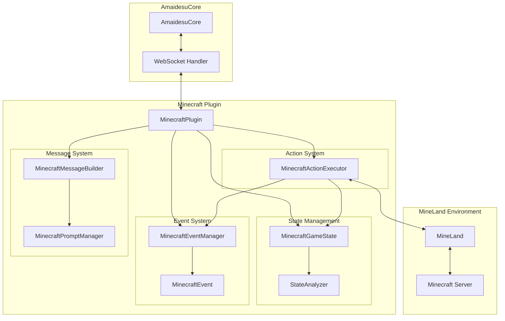
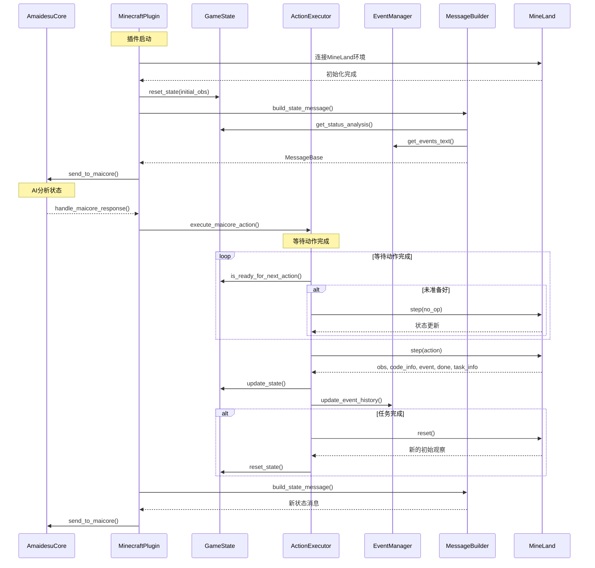
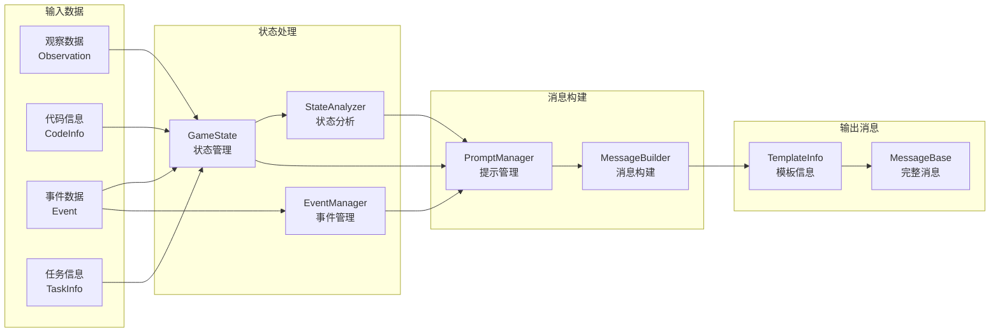
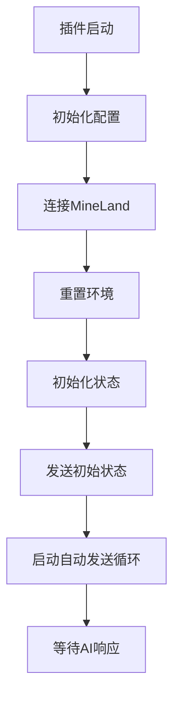
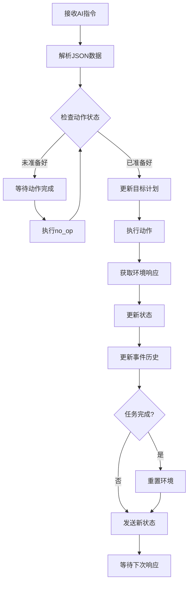

# Minecraft 插件 for AmaidesuCore

## 目录

- [Minecraft 插件 for AmaidesuCore](#minecraft-插件-for-amaidesucore)
  - [目录](#目录)
  - [概述](#概述)
  - [架构设计](#架构设计)
    - [核心架构图](#核心架构图)
    - [组件协作时序图](#组件协作时序图)
    - [数据流向图](#数据流向图)
  - [核心组件详解](#核心组件详解)
    - [1. MinecraftGameState（游戏状态管理）](#1-minecraftgamestate游戏状态管理)
    - [2. MinecraftActionExecutor（动作执行器）](#2-minecraftactionexecutor动作执行器)
    - [3. MinecraftEventManager（事件管理）](#3-minecrafteventmanager事件管理)
    - [4. MinecraftMessageBuilder（消息构建）](#4-minecraftmessagebuilder消息构建)
  - [消息交互协议](#消息交互协议)
    - [插件 → AmaidesuCore（状态同步）](#插件--amaidesucore状态同步)
    - [AmaidesuCore → 插件（动作指令）](#amaidesucore--插件动作指令)
  - [工作流程](#工作流程)
    - [系统启动流程](#系统启动流程)
    - [动作执行流程](#动作执行流程)
  - [安装和使用](#安装和使用)
    - [环境准备](#环境准备)
    - [快速开始](#快速开始)
  - [开发指南](#开发指南)
    - [扩展新功能](#扩展新功能)
    - [调试和监控](#调试和监控)
    - [性能优化](#性能优化)
  - [故障排除](#故障排除)
    - [常见问题](#常见问题)
    - [日志分析](#日志分析)
  - [核心功能](#核心功能)
  - [使用流程](#使用流程)
  - [与 AmaidesuCore 的消息交互](#与-amaidesucore-的消息交互)
    - [插件 -\> AmaidesuCore (状态同步)](#插件---amaidesucore-状态同步)
    - [AmaidesuCore -\> 插件 (动作指令)](#amaidesucore---插件-动作指令)
  - [Mineland 核心概念](#mineland-核心概念)
  - [插件代码结构简述](#插件代码结构简述)

## 概述

Minecraft插件是AmaidesuCore生态系统的重要组成部分，它将[MineLand](https://github.com/cocacola-lab/MineLand/)模拟器无缝集成到系统中。通过该插件，AmaidesuCore可以控制在MineLand环境中运行的Minecraft智能体，实现智能对话机器人在虚拟世界中的自主操作。

## 架构设计

### 核心架构图



### 组件协作时序图



### 数据流向图



## 核心组件详解

### 1. MinecraftGameState（游戏状态管理）

负责维护和管理Minecraft世界的完整状态信息：

- **状态数据**：观察数据、代码执行信息、事件、任务完成状态
- **目标管理**：当前目标、目标历史、计划和进度跟踪
- **状态分析**：通过StateAnalyzer提供智能状态解读
- **缓存优化**：避免重复分析相同状态数据

### 2. MinecraftActionExecutor（动作执行器）

处理所有与MineLand的交互操作：

- **动作解析**：解析来自AmaidesuCore的JSON指令
- **动作执行**：在MineLand环境中执行高级JavaScript动作
- **等待机制**：智能等待动作完成，必要时执行no_op操作
- **环境重置**：在任务完成时自动重置环境

### 3. MinecraftEventManager（事件管理）

专门处理游戏事件的收集和管理：

- **事件收集**：收集MineLand产生的各类事件
- **去重处理**：避免重复事件影响AI决策
- **历史管理**：维护有限长度的事件历史记录
- **格式转换**：将MineLand事件转换为统一格式

### 4. MinecraftMessageBuilder（消息构建）

负责构建发送给AmaidesuCore的消息：

- **模板构建**：通过PromptManager构建结构化提示模板
- **消息封装**：将状态信息封装为MessageBase格式
- **上下文整合**：整合状态分析、事件信息和目标进度

## 消息交互协议

### 插件 → AmaidesuCore（状态同步）

```json
{
  "message_info": {
    "template_info": {
      "template_name": "Minecraft",
      "template_items": {
        "agent_info": "智能体基本信息",
        "status_analysis": "详细状态分析",
        "observations": "原始观察数据",
        "events": "当前事件信息",
        "code_infos": "代码执行状态",
        "event_history": "事件历史记录",
        "goal_context": "目标和计划信息"
      }
    }
  },
  "message_segment": {
    "type": "text",
    "data": "游戏状态摘要和指导信息"
  }
}
```

### AmaidesuCore → 插件（动作指令）

```json
{
  "actions": "bot.chat('Hello!'); bot.collectBlock('oak_log');",
  "goal": "收集10个橡木原木",
  "plan": ["找到橡树", "砍伐橡树", "收集原木"],
  "step": "砍伐橡树获得原木",
  "targetValue": 10,
  "currentValue": 3
}
```

## 工作流程

### 系统启动流程



### 动作执行流程



## 安装和使用

### 环境准备

1. **启动Minecraft服务器**
   ```bash
   # 单人游戏开启局域网联机，或准备独立服务器
   ```

2. **安装MineLand**
   ```bash
   git clone https://github.com/cocacola-lab/MineLand
   cd MineLand
   pip install -e .
   ```

3. **配置插件**
   - 复制 `config-template.toml` 为 `config.toml`
   - 配置服务器地址和端口
   - 设置智能体参数

### 快速开始

```bash
# 在项目根目录启动
python main.py
```

插件将自动：
1. 连接到MineLand环境
2. 初始化游戏状态
3. 开始与AmaidesuCore的交互循环

## 开发指南

### 扩展新功能

1. **添加新的状态分析器**
   ```python
   # 在 state/state_analyzers.py 中添加新的分析方法
   def analyze_custom_feature(self) -> List[str]:
       # 实现自定义分析逻辑
       pass
   ```

2. **扩展事件处理**
   ```python
   # 在 events/event_manager.py 中添加新的事件处理逻辑
   def handle_custom_event(self, event: MinecraftEvent):
       # 实现自定义事件处理
       pass
   ```

3. **自定义消息模板**
   ```python
   # 在 message/prompt_templates.py 中添加新的提示模板
   CUSTOM_TEMPLATE = """
   自定义提示内容
   """
   ```

### 调试和监控

插件提供详细的日志记录：
- 状态更新日志
- 动作执行日志
- 错误和异常日志
- 性能监控信息

### 性能优化

- **状态分析缓存**：避免重复分析相同状态
- **事件历史限制**：控制内存使用
- **异步处理**：提高响应性能
- **智能等待**：优化动作执行时机

## 故障排除

### 常见问题

1. **连接MineLand失败**
   - 检查服务器地址和端口配置
   - 确认MineLand服务正常运行

2. **动作执行超时**
   - 调整 `max_wait_cycles` 参数
   - 检查JavaScript代码语法

3. **状态分析错误**
   - 检查观察数据完整性
   - 查看StateAnalyzer配置

### 日志分析

插件使用结构化日志记录，关键信息包括：
- `[INFO]` 正常运行状态
- `[WARNING]` 潜在问题提醒
- `[ERROR]` 错误和异常
- `[DEBUG]` 详细调试信息

---

**注意**：本插件专为单智能体环境设计，如需多智能体支持，请参考相关扩展文档。

## 核心功能

*   **环境管理**:
    *   通过指定的服务器地址和端口连接到正在运行的 MineLand 服务实例。
    *   初始化和管理 MineLand 模拟环境，包括任务加载、智能体配置（目前固定为单智能体 "Mai"）。
*   **状态同步与分析**:
    *   将 MineLand 环境的当前状态 (如观察数据、代码执行信息、事件、任务完成状态等) 序列化后，结合内部维护的游戏上下文信息 (目标、计划、步骤、完成度、事件历史) 发送给 AmaidesuCore。
    *   使用 `core/prompt_builder.py` 中的逻辑构建丰富的状态分析和提示词模板，通过 `template_info` 结构发送。
*   **动作执行**:
    *   接收来自 AmaidesuCore 的动作指令，并在 MineLand 环境中为智能体执行这些高级动作 (JavaScript 代码)。
    *   固定使用高级动作，不再支持或区分低级动作。
*   **目标管理**:
    *   维护当前游戏目标 (`goal`)，并记录目标变更历史 (`goal_history`)。
    *   目标可以由 AmaidesuCore 在响应中指定并更新。
*   **计划与进度跟踪**:
    *   维护当前任务计划 (`current_plan`，步骤列表)、当前执行步骤 (`current_step`)、目标值 (`target_value`) 和当前完成度 (`current_value`)。
    *   这些信息会包含在发送给 AmaidesuCore 的状态消息中，并可由 AmaidesuCore 更新。
*   **事件历史记录**:
    *   记录来自 MineLand 的不重复事件，并将其作为状态信息的一部分发送给 AmaidesuCore。
*   **定期状态发送**:
    *   插件会定期自动将当前状态发送给 AmaidesuCore，确保即使在 MaiCore 没有主动请求时也能保持信息同步，特别是在一段时间未收到 MaiCore 响应时会主动重发。
*   **上下文标签**:
    *   支持通过 `context_tags` 配置从 MaiCore 获取特定上下文信息（当前主要用于示例，具体应用待扩展）。

## 使用流程

1.  启动本地Minecraft单人游戏并开启局域网联机，在配置文件中填入端口号，或者准备一个Minecraft服务器
2.  clone [mineland项目](https://github.com/cocacola-lab/MineLand)，按照其README安装好依赖。
3.  在本项目所使用的虚拟环境中使用 `pip install -e <mineland所在路径>` 进行本地安装 Mineland。
4.  配置插件（见下一节），特别是 `server_host` 和 `server_port` 以指向正确的 Minecraft服务器
5.  按根目录的README启动本项目


## 与 AmaidesuCore 的消息交互

插件通过 `maim_message.MessageBase` 格式与 AmaidesuCore 进行通信。

### 插件 -> AmaidesuCore (状态同步)

*   **触发时机**:
    1.  插件启动并成功初始化/重置 MineLand 环境后。
    2.  在 MineLand 中执行一个动作并获得新的环境状态后。
    3.  当任务完成并自动重置环境后。
    4.  由内部定时器 `auto_send_interval` 触发，定期发送状态，或在超时未收到响应时重发。
*   **`MessageBase` 结构**:
    *   `message_info` (`BaseMessageInfo`):
        *   `platform`: 从 `self.core.platform` 获取。
        *   `message_id`: 动态生成的整数时间戳。
        *   `time`: 当前的 Unix 时间戳 (整数)。
        *   `user_info` (`UserInfo`):
            *   `platform`: 从 `self.core.platform` 获取。
            *   `user_id`: 配置文件中的 `user_id`。
            *   `user_nickname`: 配置文件中的 `nickname`。
        *   `group_info` (`GroupInfo`, 可选):
            *   `platform`: 从 `self.core.platform` 获取。
            *   `group_id`: 配置文件中的 `group_id`。如果 `group_id` 无效或未提供，则此字段为 `None`。
        *   `format_info` (`FormatInfo`):
            *   `content_format`: `"text"`
            *   `accept_format`: `"text"`
        *   `additional_config` (`Dict[str, Any]`):
            *   `maimcore_reply_probability_gain`: `1` (确保 MaiCore 必然回复此消息)。
        *   `template_info` (`TemplateInfo`):
            *   `template_name`: `"Minecraft"`
            *   `template_default`: `False`
            *   `template_items` (`Dict[str, str]`): 一个包含多个键值对的字典，用于构建发送给 LLM 的提示。这些内容由插件内部的 `core/prompt_builder.py` 生成，通常包括：
                *   智能体信息 (agent_info)
                *   当前状态分析 (status_prompts from `build_state_analysis`)
                *   原始观察数据 (observations from `self.current_obs`)
                *   当前事件 (events from `self.current_event`)
                *   代码执行信息 (code_infos from `self.current_code_info`)
                *   事件历史 (event_history from `self.event_history`)
                *   当前目标、计划、步骤、完成度等上下文信息。
    *   `message_segment` (`Seg`):
        *   `type`: `"text"`
        *   `data` (字符串): 包含当前游戏上下文信息的文本。格式如下：
            ```text
            {指示性文本，例如 "请根据上一次游戏目标，制定下一个具体目标：" 或 "请根据当前游戏状态，给出下一步动作，逐步实现目标："}

            - 目标：{当前目标 self.goal}
            - 计划：{当前计划 self.current_plan，用分号连接}
            - 当前步骤：{当前步骤 self.current_step}
            - 目标值：{目标值 self.target_value}
            - 当前完成度：{当前完成度 self.current_value}
            ```
            指示性文本的具体内容取决于当前目标值与完成度的比较。
    *   `raw_message`: 与 `message_segment.data` 相同。

### AmaidesuCore -> 插件 (动作指令)

*   **触发时机**: AmaidesuCore 在分析了插件发送的环境状态和上下文后，决定需要执行的动作和可能需要更新的元数据。
*   **`MessageBase` 结构 (插件从 `handle_maicore_response` 方法接收到的 `message` 参数)**:
    *   `message_segment`:
        *   `type`: 插件期望为 `"text"`。
        *   `data`: 一个 JSON 字符串。

    *   **动作与元数据JSON结构**
        AmaidesuCore 应发送包含以下字段的 JSON 字符串:
        ```json
        {
            "actions": "<javascript_code_string>",
            "goal": "<string (optional)>",
            "plan": ["<string>", "<string>", "... (optional)"],
            "step": "<string (optional)>",
            "targetValue": "<int (optional)>",
            "currentValue": "<int (optional)>"
        }
        ```
        
        **字段说明:**
        *   `actions` (字符串, **必需**): 包含要执行的 JavaScript 代码 (高级动作)。
        *   `goal` (字符串, 可选): 更新 Minecraft 智能体的当前目标。
        *   `plan` (字符串数组, 可选): 更新当前任务的计划步骤列表。
        *   `step` (字符串, 可选): 更新当前正在执行的计划步骤。
        *   `targetValue` (整数, 可选): 更新当前目标或任务的目标值 (例如，收集10个木头中的10)。
        *   `currentValue` (整数, 可选): 更新当前目标或任务的已完成值 (例如，已收集3个木头中的3)。
        
        **注意:**
        *   `actions` 字段是必需的。如果未提供或格式不正确，插件可能执行 `no_op` (无操作) 或记录错误。
        *   所有非 `actions` 字段都是可选的。如果提供，插件将使用这些值更新其内部状态 (目标、计划、进度等)。
        *   插件固定使用高级动作，不再解析或支持低级动作数组。

        **示例:**
        ```json
        {
            "actions": "bot.chat('Hello from MaiCore!'); bot.collectBlock('oak_log');",
            "goal": "收集10个橡木原木",
            "plan": ["找到橡树", "砍伐橡树获得原木", "收集掉落的原木"],
            "step": "砍伐橡树获得原木",
            "targetValue": 10,
            "currentValue": 3
        }
        ```
        另一个简单示例，仅执行动作：
        ```json
        {
            "actions": "bot.jump();"
        }
        ```

## Mineland 核心概念

(参考自 [MineLand DeepWiki](https://deepwiki.com/cocacola-lab/MineLand/))

*   **Gym 式接口**: MineLand 提供了一个类似 OpenAI Gym 的接口。插件通过 `mineland.MineLand()` 初始化连接，使用 `reset()` 重置环境并获取初始观察，`step(action)` 执行动作并获取下一状态。插件中的 `setup()` 和 `handle_maicore_response()` 方法分别使用了这些接口。
*   **动作系统**:
    *   **高级动作 (High-Level Actions)**: 以 JavaScript 代码形式提供，由 Mineflayer bots 执行，允许复杂的行为和与 Minecraft 世界的交互。**本插件固定使用此种动作类型。**
    *   **低级动作 (Low-Level Actions)**: 数值动作，用于基本移动和交互。本插件当前版本**不使用**低级动作。
*   **观察空间 (Observation Space)**: MineLand 的观察空间包括视觉信息 (第一人称视角图像)、实体信息 (附近实体)、库存状态、健康和饥饿度、环境数据以及声音事件等。这些信息是插件通过 `template_info` 中的 `observations` 字段发送给 AmaidesuCore 的主要内容。
*   **多智能体支持**: MineLand 支持多个智能体在同一世界中并发运行。当前插件实现主要针对单智能体 (`agents_count` 硬编码为1，智能体名为 "Mai") 进行动作解析和状态处理。

## 插件代码结构简述

主要代码位于 `src/plugins/minecraft/plugin.py`。

*   `MinecraftPlugin(BasePlugin)`: 插件的主类。
    *   `__init__`: 加载配置文件，初始化 MineLand 连接参数 (如 `server_host`, `server_port`)、智能体配置 (固定单智能体 "Mai")、图像大小、tick速率等。同时初始化内部状态，包括当前目标 (`goal`)、目标历史 (`goal_history`)、计划 (`current_plan`)、当前步骤 (`current_step`)、目标/当前值 (`target_value`, `current_value`) 和事件历史 (`event_history`)。
    *   `setup()`:
        *   使用配置的参数创建 `mineland.MineLand` 实例，连接到 Mineland 服务。
        *   重置环境 (`mland.reset()`) 并获取初始状态。
        *   向 AmaidesuCore 注册 `handle_maicore_response` 作为 WebSocket 文本消息处理器。
        *   发送初始状态给 AmaidesuCore。
        *   启动 `_auto_send_loop` 异步任务，用于定期发送状态。
    *   `_send_state_to_maicore()`:
        *   调用 `core.prompt_builder.build_state_analysis` 和 `core.prompt_builder.build_prompt` 来准备状态信息和提示词模板。
        *   构建 `MessageBase` 对象，其中 `template_info` 包含了详细的结构化状态，`message_segment.data` 包含目标和进度的文本摘要。
        *   将消息发送给 AmaidesuCore。
    *   `handle_maicore_response(message: MessageBase)`:
        *   核心回调函数，处理来自 AmaidesuCore 的指令。
        *   调用 `core.action_handler.parse_message_json` 解析收到的 JSON 字符串，提取 `actions` (JavaScript代码) 以及可选的 `goal`, `plan`, `step`, `targetValue`, `currentValue`。
        *   使用 `_update_action_data` 和 `_update_goal` 更新插件内部状态。
        *   调用 `core.action_handler.execute_mineland_action` (内部使用 `mland.step()`) 在模拟器中执行动作。
        *   更新插件的 `current_obs`, `current_code_info`, `current_event`, `current_done`, `current_task_info`, `current_step_num`。
        *   使用 `_update_event_history` 更新事件历史。
        *   如果任务完成 (`effective_done` 为 `True`)，则重置环境。
        *   调用 `_send_state_to_maicore()` 发送更新后的状态。
    *   `cleanup()`: 关闭 MineLand 环境 (`mland.close()`) 并取消 `_auto_send_loop` 任务。
    *   `_auto_send_loop()`: 异步任务，根据 `auto_send_interval` 定期发送状态，或在一段时间未收到 MaiCore 响应时主动重发。
    *   `_update_goal()`: 更新当前目标 `self.goal`，并将旧目标存入 `self.goal_history`。
    *   `_get_goal_history_text()`: (辅助函数) 获取格式化的目标历史文本 (当前未直接在消息中使用，但可供调试或未来扩展)。
    *   `_update_action_data()`: 根据从 MaiCore 响应中解析出的数据更新 `self.current_plan`, `self.current_step`, `self.target_value`, `self.current_value`。
    *   `_update_event_history()`: 将新的不重复事件添加到 `self.event_history`，并保持其大小在限制内。

*   **辅助模块**:
    *   `src/plugins/minecraft/core/prompt_builder.py`: 包含 `build_state_analysis` 和 `build_prompt` 等函数，用于从原始 Mineland 数据构建结构化的状态描述和发送给 LLM 的提示词模板。
    *   `src/plugins/minecraft/core/action_handler.py`: 包含 `parse_message_json` (解析来自 MaiCore 的 JSON 指令) 和 `execute_mineland_action` (在 Mineland 环境中执行动作) 等函数。

*   **已移除/变更**:
    *   不再使用自定义的 `MinelandJSONEncoder` 或 `json_serialize_mineland`。
    *   插件配置加载由基类 `BasePlugin` 处理。
    *   不再有 `mineland_enable_low_level_action` 的概念，插件完全基于高级动作。