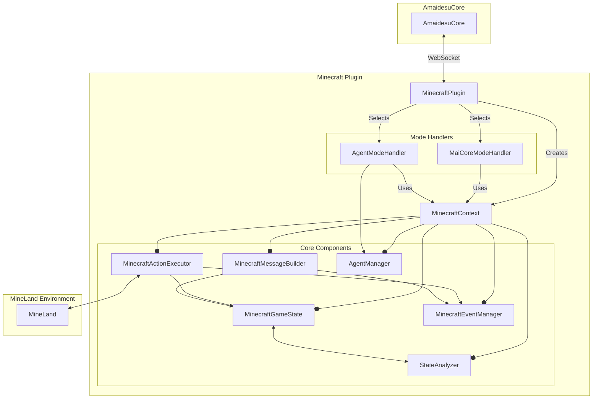
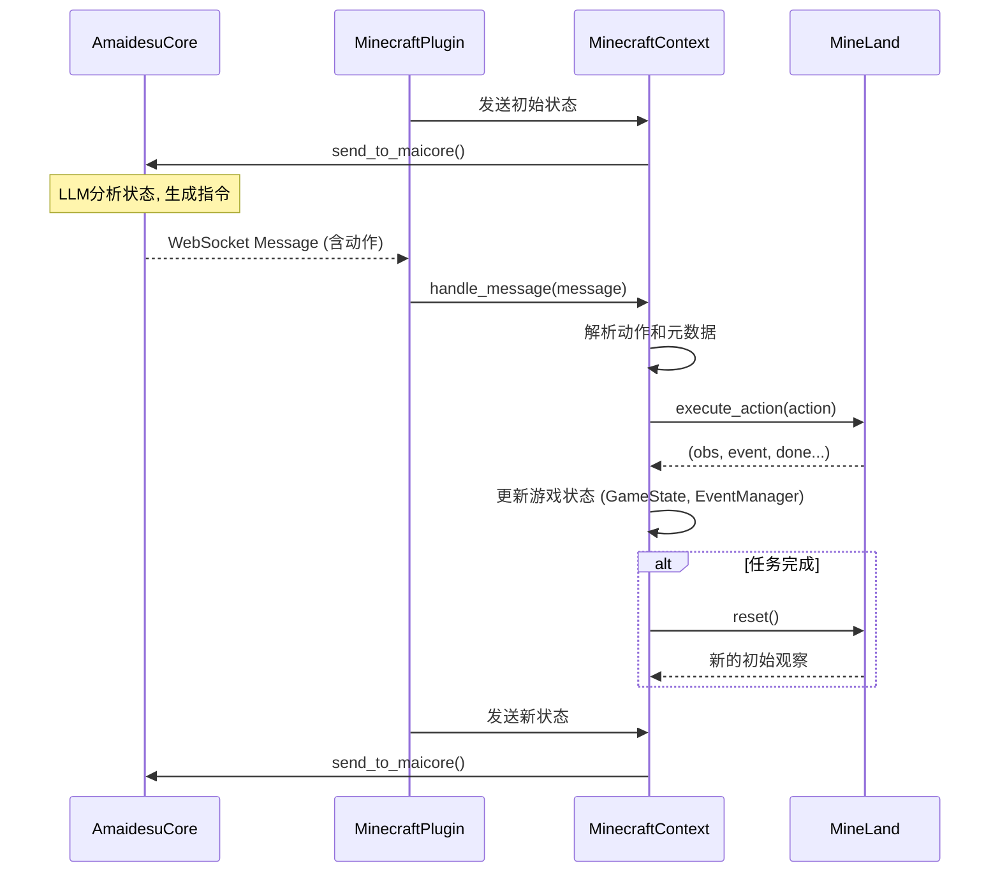
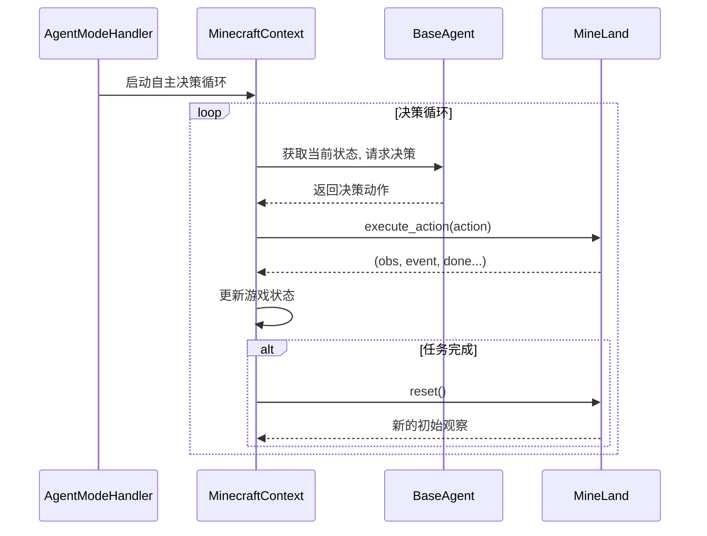

# Minecraft 插件 for AmaidesuCore

## 目录

- [Minecraft 插件 for AmaidesuCore](#minecraft-插件-for-amaidesucore)
  - [目录](#目录)
  - [概述](#概述)
  - [架构设计](#架构设计)
    - [核心架构图](#核心架构图)
    - [核心组件](#核心组件)
  - [工作流程](#工作流程)
    - [插件启动流程](#插件启动流程)
    - [MaiCore 模式工作流](#maicore-模式工作流)
    - [智能体模式工作流](#智能体模式工作流)
  - [安装和使用](#安装和使用)
    - [环境准备](#环境准备)
    - [插件配置](#插件配置)
    - [快速开始](#快速开始)
  - [开发指南](#开发指南)
    - [1. 开发新智能体](#1-开发新智能体)
    - [2. 扩展状态分析器](#2-扩展状态分析器)
  - [与 AmaidesuCore 的消息交互](#与-amaidesucore-的消息交互)
    - [插件 → AmaidesuCore (状态同步)](#插件--amaidesucore-状态同步)
    - [AmaidesuCore → 插件 (动作指令)](#amaidesucore--插件-动作指令)

## 概述

Minecraft 插件是 AmaidesuCore 生态系统的重要组成部分，它将 [MineLand](https://github.com/cocacola-lab/MineLand/) 模拟器无缝集成到系统中。通过该插件，AmaidesuCore 可以在 MineLand 环境中控制一个 Minecraft 智能体，从而在虚拟世界中执行各种任务。

本项目对 MineLand 进行了扩展，支持一些高级动作。相关代码在 [MaiM-with-u/MineLand](https://github.com/MaiM-with-u/MineLand/tree/amaidesu) 的 `amaidesu` 分支。如果不需要，可以在提示中删除高级动作的描述，例如 `followPlayer`、`swimToLand`。

插件支持两种开箱即用的控制模式：
- **MaiCore 模式**: 由 AmaidesuCore（通常背后是大型语言模型）通过 WebSocket 消息直接控制智能体的行为。
- **智能体模式**: 智能体基于内置的、可编程的决策逻辑自主行动，适合执行自动化任务。

## 架构设计

插件采用以 `MinecraftContext` 为核心的依赖注入架构，将不同的功能模块解耦，提高了可维护性和扩展性。

### 核心架构图



### 核心组件

-   **MinecraftPlugin**: 插件的主入口，负责加载配置、初始化 `MinecraftContext` 和选择并启动当前配置的模式处理器。
-   **MinecraftContext**: 插件的"心脏"，一个依赖注入容器，负责创建、管理和提供所有核心组件的实例。所有业务逻辑都通过它来访问所需的服务和状态。
-   **Mode Handlers (`MaiCoreModeHandler`, `AgentModeHandler`)**: 负责实现特定控制模式下的主循环和业务逻辑。
-   **MinecraftGameState**: 维护游戏世界中智能体的完整状态，包括生命值、饥饿度、位置、物品栏、当前目标和计划等。
-   **StateAnalyzer**: 状态分析器，将来自 MineLand 的原始观察数据（Observation）转换成对语言模型或业务逻辑更有意义的文本描述。
-   **MinecraftEventManager**: 收集、去重并管理 MineLand 环境中发生的事件，如玩家聊天、方块破坏等。
-   **MinecraftActionExecutor**: 负责向 MineLand 发送动作指令并处理其响应。它封装了动作的执行、等待和环境重置逻辑。
-   **MinecraftMessageBuilder**: 构建发送给 AmaidesuCore 的结构化状态消息（`MessageBase`）。
-   **AgentManager**: 在"智能体模式"下，负责管理和运行不同的自主决策智能体。

## 工作流程

### 插件启动流程

1.  **加载插件**: AmaidesuCore 加载 `MinecraftPlugin`。
2.  **创建上下文**: `MinecraftPlugin` 初始化，并创建 `MinecraftContext` 实例。
3.  **初始化组件**: `MinecraftContext` 在其构造函数中，按顺序实例化所有核心组件 (`GameState`, `ActionExecutor` 等)。
4.  **选择模式**: `MinecraftPlugin` 根据配置文件中的 `control_mode` 字段，选择对应的模式处理器 (`MaiCoreModeHandler` 或 `AgentModeHandler`)。
5.  **连接环境**: `setup` 方法被调用，`MinecraftContext` 负责连接到 MineLand 服务器，并获取初始的游戏观察数据。
6.  **启动模式**: `setup` 方法最后调用选定模式处理器的 `start()` 方法，插件开始按指定模式运行。

### MaiCore 模式工作流

此模式下，插件充当了 AmaidesuCore 和 MineLand 之间的桥梁。



### 智能体模式工作流

此模式下，插件根据内部逻辑自主运行，无需 AmaidesuCore 的指令。



## 安装和使用

### 环境准备

1.  **启动 Minecraft 服务器**:
    启动 Minecraft 游戏，进入单人世界，按 `Esc` 选择"对局域网开放"，或准备一个独立的服务器。记下其IP地址和端口。
2.  **安装 MineLand**:
    ```bash
    git clone https://github.com/cocacola-lab/MineLand
    cd MineLand
    pip install -e .
    ```
3.  **安装本项目依赖**
    返回本项目根目录，安装所需的依赖。

### 插件配置

1.  将 `src/plugins/minecraft/config-template.toml` 复制为 `config.toml`。
2.  编辑 `config.toml`，至少需要配置以下关键项：

    ```toml
    # config.toml

    # [必需] 控制模式: "maicore" 或 "agent"
    control_mode = "maicore"

    # [必需] 你的Minecraft服务器地址和端口
    server_host = "127.0.0.1"
    server_port = 52345 # 这里填你自己的端口

    # [必需] 用于向MaiCore发送和识别消息的身份信息
    user_id = "your_user_id"
    nickname = "Minecraft Observer"
    group_id = "your_group_id" # 如果在群聊中使用，请填写

    # [可选] 智能体模式默认使用的智能体类型
    [agent_manager]
    default_agent_type = "simple"
    ```

### 快速开始

在项目根目录启动 AmaidesuCore：
```bash
python main.py
```
插件将自动加载、连接到 MineLand 环境，并根据配置的 `control_mode` 开始运行。

## 开发指南

本插件的扩展基于模块化设计，你可以通过创建新的类并将其集成到现有系统中来添加功能。

### 1. 开发新智能体

如果你想在"智能体模式"下实现更复杂的自主行为，可以开发自己的智能体。

**第一步：创建智能体文件**

在 `src/plugins/minecraft/agents/` 目录下创建一个新文件，例如 `custom_agent.py`。在该文件中定义你的智能体类，它必须继承自 `BaseAgent`。

```python
# src/plugins/minecraft/agents/custom_agent.py
from typing import Dict, Any, Optional
from .base_agent import BaseAgent
from ..state.game_state import MinecraftGameState

class CustomAgent(BaseAgent):
    """一个自定义的智能体，会在下雨时寻找庇护所。"""

    async def initialize(self, config: Dict[str, Any]):
        """初始化智能体，可以从配置中读取自定义参数。"""
        await super().initialize(config)
        self.shelter_material = config.get("shelter_material", "cobblestone")
        self.logger.info(f"自定义智能体已初始化，庇护所材料: {self.shelter_material}")

    async def make_decision(self, game_state: MinecraftGameState) -> str:
        """
        核心决策逻辑。
        根据当前游戏状态，返回一个或多个JavaScript动作字符串。
        """
        # 检查天气
        if game_state.current_obs and game_state.current_obs.get("is_raining"):
            # 如果下雨，执行寻找庇护所的动作
            return f"bot.chat('下雨了，快找地方躲雨！'); bot.collectBlock('{self.shelter_material}');"
        
        # 默认情况下，原地不动并报告状态
        return "bot.chat('天气晴朗，一切正常。');"

    def get_agent_type(self) -> str:
        return "custom"
```

**第二步：注册智能体**

打开 `src/plugins/minecraft/agents/agent_manager.py`，在 `_register_builtin_agents` 方法中导入并注册你的新智能体。

```python
# src/plugins/minecraft/agents/agent_manager.py

class AgentManager:
    # ... 其他代码 ...
    async def _register_builtin_agents(self):
        """注册内置智能体类型"""
        try:
            from .simple_agent import SimpleAgent
            self._agents["simple"] = SimpleAgent
            self.logger.info("已注册简单智能体")

            # 在这里添加你的智能体
            from .custom_agent import CustomAgent
            self._agents["custom"] = CustomAgent
            self.logger.info("已注册自定义智能体")

        except ImportError as e:
            self.logger.error(f"无法导入智能体: {e}")
            raise
    # ... 其他代码 ...
```

**第三步：配置使用**

在 `config.toml` 中，将 `control_mode` 设置为 `agent`，并指定默认智能体为你的新智能体类型。

```toml
# config.toml
control_mode = "agent"

[agent_manager]
default_agent_type = "custom" # <-- 使用你的智能体

# 为你的智能体提供自定义配置
[agents.custom]
shelter_material = "dirt" # 例如，用泥土造庇护所
```

### 2. 扩展状态分析器

状态分析器负责将原始的游戏观察数据转化为对 LLM 或其他逻辑更有价值的文本信息。你可以添加自定义的分析逻辑。

**第一步：创建分析器文件**

在 `src/plugins/minecraft/state/analyzers/` 目录下创建一个新文件，例如 `custom_analyzer.py`。

```python
# src/plugins/minecraft/state/analyzers/custom_analyzer.py
from typing import List, Optional
from .base_analyzer import BaseAnalyzer

class CustomAnalyzer(BaseAnalyzer):
    """一个自定义分析器，用于检测玩家是否在饥饿状态。"""

    def analyze(self) -> List[str]:
        """执行分析并返回描述性文本列表。"""
        analysis = []
        try:
            hunger = self.obs.get("food")
            if hunger is not None and hunger < 6: # 饥饿度低于3格鸡腿
                analysis.append(f"警告：饥饿度严重不足（{hunger}/20），有可能会饿死。")
        except Exception as e:
            self.logger.warning(f"自定义饥饿分析出错: {e}")
        return analysis
```

**第二步：集成分析器**

打开 `src/plugins/minecraft/state/analyzers/state_analyzer.py`，导入你的新分析器，并在 `analyze_all` 方法中调用它。

```python
# src/plugins/minecraft/state/analyzers/state_analyzer.py
# ... 导入
from .custom_analyzer import CustomAnalyzer # <-- 导入你的分析器

class StateAnalyzer(BaseAnalyzer):
    def __init__(self, obs: Optional[Dict[str, Any]], config: Optional[Dict[str, Any]] = None):
        super().__init__(obs, config)
        self.health_analyzer = HealthAnalyzer(obs, config)
        self.position_analyzer = PositionAnalyzer(obs, config)
        self.inventory_analyzer = InventoryAnalyzer(obs, config)
        self.equipment_analyzer = EquipmentAnalyzer(obs, config)
        self.nearby_entities_analyzer = NearbyEntitiesAnalyzer(obs, config)
        # 在这里初始化你的分析器
        self.custom_analyzer = CustomAnalyzer(obs, config)

    def set_observation(self, obs: Dict[str, Any]):
        # ...
        self.custom_analyzer.set_observation(obs) # <-- 确保它也能接收到新数据

    def analyze_all(self) -> List[str]:
        # ...
        status_prompts.extend(self.health_analyzer.analyze())
        # ...
        
        # 在这里调用你的分析器
        status_prompts.extend(self.custom_analyzer.analyze())

        return status_prompts
```
完成以上步骤后，每次插件生成状态报告时，你的自定义饥饿分析结果就会自动包含在内。

## 与 AmaidesuCore 的消息交互

插件通过 `maim_message.MessageBase` 格式与 AmaidesuCore 进行通信。

### 插件 → AmaidesuCore (状态同步)

-   **触发时机**:
    1.  环境初始化或重置后。
    2.  执行一个动作并获得新状态后。
    3.  在 `MaiCore` 模式下，由内部定时器触发，定期发送状态或在超时未收到响应时重发。
-   **`MessageBase` 结构**:
    -   `template_info` (`TemplateInfo`):
        -   `template_name`: `"Minecraft"`
        -   `template_items`: 包含发送给 LLM 的详细上下文信息，由 `MinecraftMessageBuilder` 构建，主要包括：
            -   智能体信息 (`agent_info`)
            -   状态分析 (`status_analysis`)
            -   原始观察数据 (`observations`)
            -   当前事件 (`events`)
            -   代码执行信息 (`code_infos`)
            -   事件历史 (`event_history`)
            -   目标与计划 (`goal_context`)
    -   `message_segment` (`Seg`):
        -   `type`: `"text"`
        -   `data`: 包含当前游戏上下文的简要文本，用于引导 LLM。

### AmaidesuCore → 插件 (动作指令)

-   **触发时机**: 在 `MaiCore` 模式下，当 AmaidesuCore 分析完状态后，决定要执行的动作时。
-   **`MessageBase` 结构**:
    -   `message_segment.data`: 一个 JSON 字符串。
-   **JSON结构**:
    ```json
    {
        "actions": "<javascript_code_string>",
        "goal": "<string (optional)>",
        "plan": ["<string>", "<string>", "... (optional)"],
        "step": "<string (optional)>",
        "targetValue": "<int (optional)>",
        "currentValue": "<int (optional)>"
    }
    ```
    -   `actions` (字符串, **必需**): 要执行的高级 JavaScript 动作代码。
    -   其他字段 (可选): 用于更新插件内部的 `GameState` 中的目标和计划。
-   **示例**:
    ```json
    {
        "actions": "bot.chat('Hello from MaiCore!'); bot.collectBlock('oak_log');",
        "goal": "收集10个橡木原木",
        "plan": ["找到橡树", "砍伐橡树获得原木", "收集掉落的原木"],
        "step": "砍伐橡树获得原木",
        "targetValue": 10,
        "currentValue": 3
    }
    ```