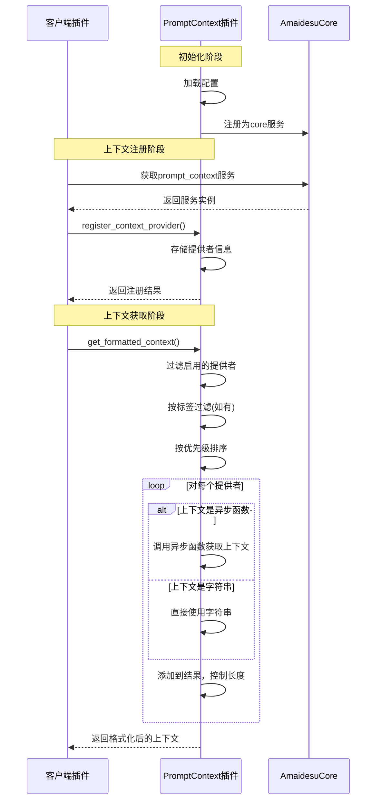

# Prompt Context 插件

## 概述

Prompt Context 插件是一个用于管理和聚合上下文信息的核心插件。它允许其他插件注册上下文提供者，并在需要时获取聚合后的上下文信息，这些信息可以用于增强 AI 对话的上下文感知能力。

## 消息处理流程

1. 初始化阶段：
   - 插件加载配置信息（从 config.toml）
   - 注册为 core 服务（服务名：`prompt_context`）
   - 初始化上下文提供者存储字典 `_context_providers`

2. 上下文注册阶段：
   - 其他插件通过 `register_context_provider` 方法注册上下文提供者
   - 每个提供者可以指定上下文信息（字符串或异步函数）、优先级、标签和启用状态
   - 上下文信息可以是静态字符串或返回字符串的异步函数

3. 上下文获取阶段：
   - 通过 `get_formatted_context` 方法获取聚合的上下文
   - 过滤启用的提供者
   - 根据标签过滤（如果指定）
   - 根据优先级排序（数字越小优先级越高）
   - 格式化并组合输出，处理长度限制

## 核心实现

插件的核心功能在于管理上下文提供者和聚合上下文信息：

1. **上下文提供者管理**：
   - 使用字典存储提供者信息，键为提供者名称
   - 每个提供者包含：名称、上下文信息、优先级、标签和启用状态
   - 支持注册、更新和注销提供者

2. **上下文动态获取**：
   - 支持将上下文信息定义为异步函数，以便动态生成内容
   - 在获取时自动调用异步函数获取最新上下文

3. **上下文格式化与长度控制**：
   - 按优先级组合多个提供者的内容
   - 支持添加提供者名称作为标题
   - 实现最大长度控制，包括智能截断机制

## 提供的服务

插件注册了名为 `prompt_context` 的 core 服务，提供以下主要方法：

### 1. 注册上下文提供者
```python
register_context_provider(
    provider_name: str,
    context_info: Any,  # 字符串或异步函数
    priority: Optional[int] = None,
    tags: Optional[List[str]] = None,
    enabled: bool = True
) -> bool
```

### 2. 更新上下文信息
```python
update_context_info(
    provider_name: str,
    context_info: Optional[str] = None,
    enabled: Optional[bool] = None
) -> bool
```

### 3. 获取格式化上下文
```python
async def get_formatted_context(
    tags: Optional[List[str]] = None,
    max_length: Optional[int] = None
) -> str
```

### 4. 注销上下文提供者
```python
unregister_context_provider(provider_name: str) -> bool
```

## 时序图



## 使用示例

### 注册静态上下文提供者
```python
# 获取prompt_context服务
prompt_context_service = await core.get_service("prompt_context")

# 注册上下文提供者（静态字符串）
await prompt_context_service.register_context_provider(
    provider_name="system_info",
    context_info="当前系统使用说明：这是一个AI助手系统，可以帮助用户完成各种任务。",
    priority=10,  # 高优先级（数字小）
    tags=["system", "intro"]
)
```

### 注册动态上下文提供者
```python
# 定义一个异步函数来动态获取时间信息
async def get_time_info():
    from datetime import datetime
    now = datetime.now()
    return f"当前时间: {now.strftime('%Y-%m-%d %H:%M:%S')}"

# 注册上下文提供者（异步函数）
await core.get_service("prompt_context").register_context_provider(
    provider_name="time_provider",
    context_info=get_time_info,  # 传入异步函数
    priority=50,
    tags=["time", "system"]
)
```

### 获取上下文
```python
# 获取带有特定标签的上下文
context = await core.get_service("prompt_context").get_formatted_context(
    tags=["system"],
    max_length=500
)

# 将上下文用于AI对话
response = await llm_service.chat(
    messages=[
        {"role": "system", "content": f"你是一个有用的助手。{context}"},
        {"role": "user", "content": user_message}
    ]
)
```

## 注意事项

1. 上下文提供者的优先级数字越小，优先级越高
2. 标签过滤是"与"关系，即必须包含所有指定的标签
3. 上下文信息可以是字符串或异步函数（必须是 `async def` 定义的协程函数）
4. 总上下文长度会根据配置或调用时参数进行限制 