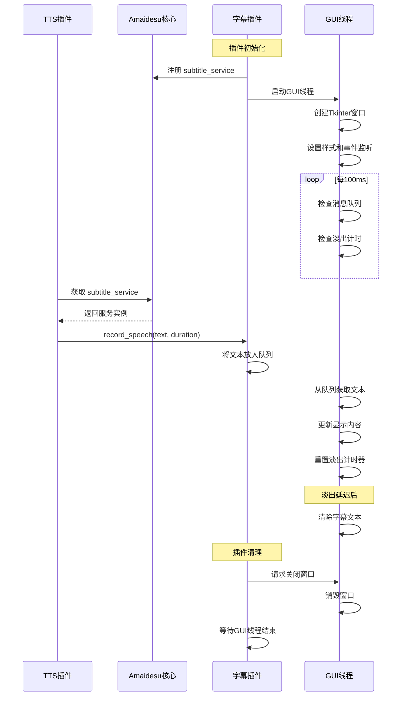

# Amaidesu 字幕插件 (Subtitle Plugin)

字幕插件是 Amaidesu VTuber 项目的一个核心组件，用于在屏幕上以字幕形式显示 AI 语音内容。本插件创建一个可拖动、始终置顶的透明窗口，用于实时显示 AI 说话的内容。

## 功能特点

- 创建透明、置顶的字幕窗口
- 支持拖动位置（左键拖动）
- 支持自定义字体、颜色、尺寸
- 自动淡出（可配置延迟时间）
- 跨平台支持（Windows、macOS 适配）
- 低资源占用（独立线程运行，不阻塞主进程）

## 依赖服务

本插件不依赖其他核心服务，但需要以下系统库：

- `tkinter`: 用于GUI界面显示（Python标准库）

## 注册服务

本插件注册了以下服务，可被其他插件调用：

- `subtitle_service`: 提供字幕显示服务

## 消息处理流程

1. 初始化插件时：
   - 加载配置文件
   - 检查 tkinter 是否可用
   - 启动独立 GUI 线程

2. 在 `setup()` 阶段：
   - 注册 `subtitle_service` 服务
   - 启动 GUI 线程，创建置顶窗口

3. 其他插件调用字幕服务：
   - 调用 `record_speech(text, duration)` 接口
   - 文本被放入线程安全队列

4. GUI 线程处理：
   - 定期检查队列（每100ms）
   - 更新字幕内容
   - 管理淡出效果

5. 用户交互：
   - 支持拖动窗口（鼠标左键）
   - 支持关闭窗口（鼠标右键）

6. 清理阶段：
   - 安全关闭窗口
   - 等待线程结束

## 时序图



## 服务使用示例

其他插件（如TTS插件）可以通过以下方式调用字幕服务：

```python
# 在 TTS 或其他插件中获取和使用字幕服务
subtitle_service = self.core.get_service("subtitle_service")
if subtitle_service:
    # 文本: 要显示的文本
    # duration: 语音持续时间（秒），当前版本未使用此参数
    await subtitle_service.record_speech("这是要显示的文字", 3.0)
```

## 核心代码解析

### 1. 服务注册与线程启动

插件初始化时启动独立线程运行GUI，避免阻塞主线程：

```python
async def setup(self):
    await super().setup()
    if not self.enabled:
        return

    # 注册自己为服务，供 TTS 插件调用
    self.core.register_service("subtitle_service", self)
    
    # 启动 GUI 线程
    self.is_running = True
    self.gui_thread = threading.Thread(target=self._run_gui, daemon=True)
    self.gui_thread.start()
```

### 2. 字幕显示接口

提供给其他插件调用的主要接口：

```python
async def record_speech(self, text: str, duration: float):
    """
    接收文本和时长，将其放入队列供 GUI 线程显示。
    """
    if not self.enabled or not self.is_running:
        return

    if not text:
        return

    # 清理文本 (移除换行符)
    cleaned_text = text.replace("\n", " ").replace("\r", "")

    try:
        # 将文本放入队列
        self.text_queue.put(cleaned_text)
    except Exception as e:
        self.logger.error(f"放入字幕队列时出错: {e}", exc_info=True)
```

### 3. 线程间通信机制

使用队列实现线程安全的数据传递：

```python
# 在初始化函数中
self.text_queue = queue.Queue()  # 用于从 record_speech 发送文本到 GUI 线程

# 在GUI线程中定期检查
def _check_queue(self):
    try:
        while not self.text_queue.empty():
            text = self.text_queue.get_nowait()
            self._update_subtitle_display(text)
    except queue.Empty:
        pass
```

## 开发注意事项

1. **跨平台兼容性**：
   - 不同操作系统对Tkinter透明窗口的支持不同
   - macOS需要特殊处理透明效果

2. **线程安全**：
   - 所有Tkinter操作必须在GUI线程中执行
   - 使用队列进行线程间通信
   - 避免直接从其他线程修改GUI元素

3. **资源管理**：
   - 确保插件清理时正确终止线程
   - 妥善处理窗口关闭事件

4. **错误处理**：
   - 捕获并记录所有可能的异常
   - 即使在错误情况下也能继续运行

## 性能优化

1. 使用守护线程保证主程序退出时GUI线程自动退出
2. 采用事件驱动模型而非轮询
3. 最小化跨线程操作，减少锁竞争 