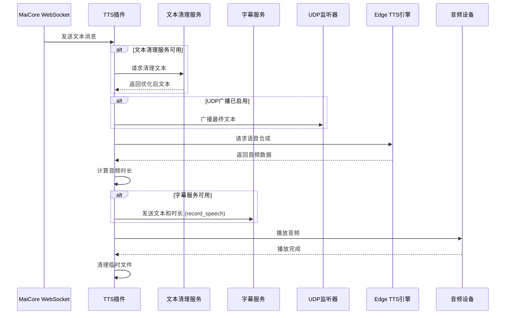

# Amaidesu TTS 插件

TTS（语音合成）插件是 Amaidesu VTuber 项目的核心组件，负责将文本消息转换为语音并播放给用户。插件支持多种 TTS 引擎：**Microsoft Edge TTS** 和 **阿里云 Qwen-Omni**，并支持与其他插件如文本清理服务和字幕服务的集成。

## 功能特点

- 接收并处理 WebSocket 文本消息
- **多引擎支持**: 
  - Microsoft Edge TTS（免费，本地处理）
  - 阿里云 Qwen-Omni（需要 API 密钥，更自然的语音合成）
- 支持选择不同语音角色和输出音频设备
- 支持通过 UDP 广播 TTS 内容（用于外部监听）
- 集成文本清理服务（可选）
- 发送播放信息到字幕服务（可选）
- 智能错误处理和资源管理
- **Qwen TTS 音频后处理**：支持音量调节、噪声添加等特效

## 依赖

### 必需依赖

#### 通用依赖
- `sounddevice`: 音频播放
- `soundfile`: 音频文件处理
- `numpy`: 用于音频数据处理

#### Edge TTS 依赖
- `edge-tts`: Microsoft Edge TTS 引擎

#### Qwen TTS 依赖
- `aiohttp`: HTTP 客户端（用于调用 Qwen API）
- `pydub`: 音频后处理（可选，用于音频特效）

### 可选服务依赖

- `text_cleanup`: 用于优化 TTS 的文本（由 LLM Text Processor 插件提供）
- `subtitle_service`: 用于显示正在播放的文本（由 Subtitle 插件提供）

### 安装依赖

```bash
# 基础依赖
pip install sounddevice soundfile numpy

# Edge TTS（如果使用 Edge TTS 引擎）
pip install edge-tts

# Qwen TTS（如果使用 Qwen TTS 引擎）
pip install aiohttp
pip install pydub  # 可选，用于音频后处理
```

## 消息处理流程

TTS 插件处理流程如下：

1. **消息接收**：监听来自 MaiCore 的所有 WebSocket 消息，过滤出文本类型消息
2. **文本清理**（可选）：通过 `text_cleanup` 服务优化文本内容
3. **UDP 广播**（可选）：将最终文本通过 UDP 广播到外部监听者
4. **语音合成**：使用 Edge TTS 将文本合成为语音并保存为临时文件
5. **播放前处理**：计算音频时长并通知字幕服务
6. **音频播放**：通过 sounddevice 播放音频
7. **资源清理**：播放完成后删除临时文件

## 时序图



## 核心服务使用

### 文本清理服务使用示例

TTS 插件通过`text_cleanup`服务来优化文本以获得更好的语音效果：

```python
# 获取文本清理服务
cleanup_service = self.core.get_service("text_cleanup")
if cleanup_service:
    # 尝试清理文本
    cleaned = await cleanup_service.clean_text(original_text)
    if cleaned:
        # 使用清理后的文本
        final_text = cleaned
```

### 字幕服务通知示例

TTS 插件在播放音频前会通知字幕服务展示对应文本：

```python
# 通知字幕服务
if duration_seconds is not None and duration_seconds > 0:
    subtitle_service = self.core.get_service("subtitle_service")
    if subtitle_service:
        # 异步调用，不阻塞播放
        asyncio.create_task(subtitle_service.record_speech(text, duration_seconds))
```

## 核心代码解析

### 1. 消息处理函数

```python
async def handle_maicore_message(self, message: MessageBase):
    """处理从 MaiCore 收到的消息，如果是文本类型，则进行 TTS 处理。"""
    # 检查消息段是否存在且类型为 'text'
    if message.message_segment and message.message_segment.type == "text":
        original_text = message.message_segment.data
        if not isinstance(original_text, str) or not original_text.strip():
            return

        original_text = original_text.strip()
        final_text = original_text

        # 1. (可选) 清理文本 - 通过服务调用
        cleanup_service = self.core.get_service("text_cleanup")
        if cleanup_service:
            cleaned = await cleanup_service.clean_text(original_text)
            if cleaned:
                final_text = cleaned

        # 2. (可选) UDP 广播
        if self.udp_enabled and self.udp_socket and self.udp_dest:
            self._broadcast_text(final_text)

        # 3. 执行 TTS
        await self._speak(final_text)
```

### 2. TTS 执行函数

```python
async def _speak(self, text: str):
    """执行 Edge TTS 合成和播放，并通知 Subtitle Service。"""
    async with self.tts_lock:
        try:
            # --- TTS 合成 ---
            communicate = edge_tts.Communicate(text, self.voice)
            with tempfile.NamedTemporaryFile(delete=False, suffix=".mp3") as tmp_file:
                tmp_filename = tmp_file.name
            await asyncio.to_thread(communicate.save_sync, tmp_filename)
            
            # --- 读取音频并计算时长 ---
            audio_data, samplerate = await asyncio.to_thread(sf.read, tmp_filename, dtype="float32")
            if samplerate > 0 and isinstance(audio_data, np.ndarray):
                duration_seconds = len(audio_data) / samplerate
                
                # --- 通知 Subtitle Service ---
                if duration_seconds > 0:
                    subtitle_service = self.core.get_service("subtitle_service")
                    if subtitle_service:
                        asyncio.create_task(subtitle_service.record_speech(text, duration_seconds))
            
            # --- 播放音频 ---
            await asyncio.to_thread(
                sd.play, audio_data, samplerate=samplerate, 
                device=self.output_device_index, blocking=True
            )
        finally:
            # --- 清理临时文件 ---
            if tmp_filename and os.path.exists(tmp_filename):
                os.remove(tmp_filename)
```

### 3. 广播机制

```python
def _broadcast_text(self, text: str):
    """通过 UDP 发送文本 (用于外部监听)。"""
    if self.udp_socket and self.udp_dest:
        try:
            message_bytes = text.encode("utf-8")
            self.udp_socket.sendto(message_bytes, self.udp_dest)
        except Exception as e:
            self.logger.warning(f"发送 TTS 内容到 UDP 监听器失败: {e}")
```

## 配置说明

插件通过 `config.toml` 文件进行配置，主要配置项包括：

### 基本配置

```toml
[tts]
# 使用的 Edge TTS 语音模型
voice = "zh-CN-XiaoxiaoNeural"
# 指定输出音频设备名称 (留空或注释掉以使用系统默认设备)
output_device_name = ""

# 大模型TTS配置
[omni_tts]
enabled = false          # 是否启用大模型TTS
api_key = ""             # 阿里云百炼API Key，留空则使用环境变量DASHSCOPE_API_KEY
model_name = "qwen2.5-omni-7b"  # 模型名称
voice = "Chelsie"         # 语音音色
format = "wav"           # 音频格式
base_url = "https://dashscope.aliyuncs.com/compatible-mode/v1"  # API基础URL

# 音频后处理配置
[omni_tts.post_processing]
enabled = false          # 是否启用音频后处理
volume_reduction = 0.0  # 音量降低程度(dB)
noise_level = 0.0      # 杂音强度，0-1之间的浮点数

[udp_broadcast]
# 是否将最终要播报的文本通过 UDP 广播出去
enable = false
# 广播的目标主机地址
host = "127.0.0.1"
# 广播的目标 UDP 端口
port = 9998
```

### 引擎选择说明

默认情况下，插件使用 Edge TTS 引擎。当 `omni_tts.enabled = true` 时，会优先使用 Omni TTS 引擎。

#### Edge TTS 引擎
- **优点**: 免费、无需网络、响应快速
- **缺点**: 语音相对机械，选择有限
- **适用**: 测试开发、网络受限环境

#### Omni TTS 引擎  
- **优点**: 语音自然、支持多种音色、可后处理
- **缺点**: 需要 API 密钥、依赖网络、有成本
- **适用**: 生产环境、追求高质量语音

### API 密钥配置

获取阿里云百炼 API 密钥：
1. 访问 [阿里云百炼控制台](https://bailian.console.aliyun.com/)
2. 创建应用并获取 API 密钥
3. 在配置文件中设置 `api_key` 或设置环境变量：
   ```bash
   export DASHSCOPE_API_KEY="your-api-key-here"
   ```

## 优化与扩展

1. **多语言支持**：可通过配置不同的 `voice` 值支持多种语言
2. **高级音频控制**：可添加音量、语速等参数配置
3. **并发处理**：当前使用互斥锁确保单个 TTS 任务执行，可扩展为队列机制
4. **缓存机制**：对常用语句进行缓存以减少 TTS 调用
5. **情感分析**：集成情感分析插件以自动选择合适的语音风格

## 使用示例

### 启用 Omni TTS

1. 修改配置文件：
   ```toml
   [omni_tts]
   enabled = true
   api_key = "your-api-key-here"
   model_name = "qwen2.5-omni-7b"
   voice = "Chelsie"
   ```

2. 重启 Amaidesu 服务

### 启用音频后处理

```toml
[omni_tts.post_processing]
enabled = true
volume_reduction = 2.0  # 降低 2dB 音量
noise_level = 0.1       # 添加 10% 强度的背景噪声
```

## 开发注意事项

1. 确保正确安装所有依赖项
2. 注意音频设备兼容性，特别是在跨平台场景
3. **Qwen TTS 需要网络连接**，确保网络稳定
4. **API 密钥安全**：不要将密钥提交到版本控制系统
5. 考虑长文本的分段处理以提高响应速度
6. 确保临时文件的正确清理，避免磁盘空间占用
7. **成本控制**：Qwen TTS 按调用收费，注意使用频率

## 故障排除

### Omni TTS 相关问题

- **API 密钥错误**: 检查密钥是否正确设置
- **网络连接问题**: 确保可以访问阿里云服务
- **音频后处理失败**: 检查是否安装了 `pydub` 库
- **依赖缺失**: 运行 `pip install aiohttp pydub` 安装必要依赖
- **未启用**: 确保配置文件中 `omni_tts.enabled = true`

### Edge TTS 相关问题

- **语音模型不支持**: 检查语音模型名称是否正确
- **网络问题**: Edge TTS 首次使用时需要下载模型

### 通用问题

- **音频设备问题**: 检查 `output_device_name` 配置
- **权限问题**: 确保有音频设备访问权限 