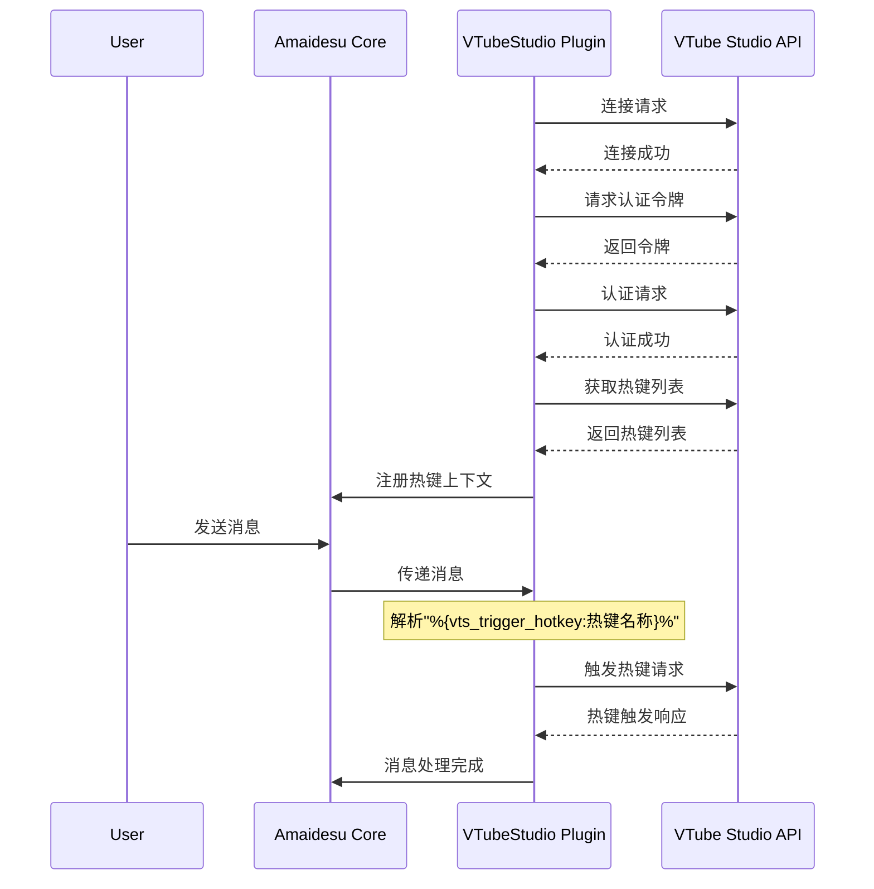

# VTube Studio Plugin

VTube Studio插件是一个用于连接[VTube Studio](https://denchisoft.com/)的Amaidesu组件，允许虚拟形象与聊天机器人交互，实现表情、动作和热键触发等功能。

## 功能概述

- 自动连接到VTube Studio API
- 自动处理认证流程
- 获取并注册可用热键到提示上下文
- 从聊天消息中解析和触发热键
- 提供面部参数控制（微笑、眨眼等）
- 支持加载/卸载挂件

## 依赖

- Python 3.11+（推荐，内置`tomllib`）或Python 3.8+（需额外安装`toml`）
- [pyvts](https://github.com/Genteki/pyvts)库
- Core服务：
  - `prompt_context` - 用于注册热键提示
  - WebSocket消息处理系统

## 安装

1. 确保安装了必要的依赖：
   ```bash
   pip install pyvts
   ```

2. 将插件目录复制到`src/plugins/`下

3. 从模板创建配置文件：
   ```bash
   cp src/plugins/vtube_studio/config-template.toml src/plugins/vtube_studio/config.toml
   ```

4. 编辑配置文件，根据需要调整参数

## 消息处理流程

插件通过以下流程处理消息和触发VTube Studio动作：

1. 接收来自Core的WebSocket消息
2. 解析消息中的热键触发标记
3. 执行相应的VTube Studio API调用
4. 返回结果或触发相应动作

### Mermaid时序图



## 配置说明

配置文件位于`src/plugins/vtube_studio/config.toml`，包含以下主要选项：

```toml
[vtube_studio]
enabled = true  # 是否启用插件
plugin_name = "Amaidesu_VTS_Connector"  # 在VTS中显示的插件名称
developer = "mai-devs"  # 开发者名称
authentication_token_path = "./src/plugins/vtube_studio/vts_token.txt"  # 令牌存储路径
vts_host = "localhost"  # VTS API主机
vts_port = 8001  # VTS API端口

# 提示上下文相关设置
register_hotkeys_context = true  # 是否注册热键到提示
hotkeys_context_priority = 50  # 上下文优先级
```

## 核心代码讲解

### 初始化和连接

```python
def __init__(self, core: AmaidesuCore, plugin_config: Dict[str, Any]):
    # 初始化插件并加载配置
    self.vts = pyvts.vts(plugin_info=plugin_info, vts_api_info=vts_api_info)

async def _connect_and_auth(self):
    # 连接到VTS并处理认证流程
    await self.vts.connect()
    await self.vts.request_authenticate_token()
    authenticated = await self.vts.request_authenticate()
```

### 热键处理

```python
async def handle_maicore_message(self, message: MessageBase):
    # 从消息中解析热键触发标记
    hotkey_pattern = r"%\{vts_trigger_hotkey:([^}]+)\}%"
    hotkey_matches = re.findall(hotkey_pattern, original_text)
    
    # 触发所有匹配到的热键
    for hotkey_name in hotkey_matches:
        await self.trigger_hotkey(hotkey_name)
```

### 参数控制

插件提供几个简化的参数控制方法：

```python
async def close_eyes(self) -> bool:
    # 闭眼动作
    await self.set_parameter_value("EyeOpenLeft", 0)
    await self.set_parameter_value("EyeOpenRight", 0)

async def smile(self, value: float = 1) -> bool:
    # 微笑控制
    return await self.set_parameter_value("MouthSmile", value)
```

## 服务使用示例

该插件注册了`vts_control`服务，可以被其他插件调用：

```python
# 在其他插件中获取VTS控制服务
vts_service = core.get_service("vts_control")
if vts_service:
    # 触发表情热键
    await vts_service.trigger_hotkey("微笑")
    
    # 控制面部参数
    await vts_service.smile(0.8)  # 80%的微笑
    await vts_service.close_eyes()  # 闭眼
    
    # 加载自定义挂件
    item_id = await vts_service.load_item(
        file_name="heart.png",
        position_x=0.5,
        position_y=0.5,
        size=0.3
    )
    
    # 稍后卸载挂件
    await vts_service.unload_item(item_instance_id_list=[item_id])
```

## AI提示格式

向大语言模型发送的消息中可以包含以下格式的标记来触发VTube Studio热键：

```
%{vts_trigger_hotkey:热键名称}%
```

例如：

```
这是一个测试消息，我很高兴能帮助你！%{vts_trigger_hotkey:微笑}%
```

上面的消息会触发VTube Studio中名为"微笑"的热键。

## 开发注意事项

1. 在开发调试过程中，确保VTube Studio正在运行，并已启用API
2. 第一次连接时，VTube Studio会弹出窗口要求授权
3. 认证令牌将保存在指定路径，以便后续使用
4. 对于复杂的动画序列，建议在VTube Studio中设置好热键，然后通过插件触发

## 错误处理

常见错误及解决方案：

- 连接拒绝：确保VTube Studio已启动并已启用API（端口8001）
- 认证失败：检查认证令牌文件，可能需要删除并重新授权
- 热键未找到：确保热键名称完全匹配（区分大小写） 